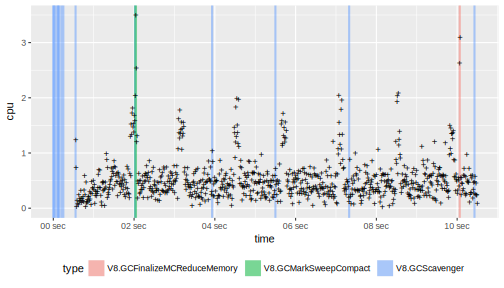
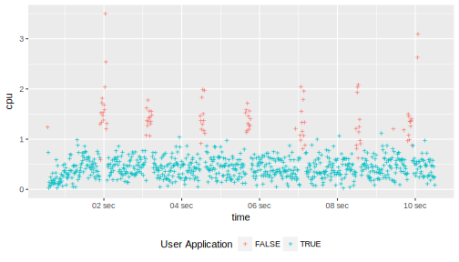
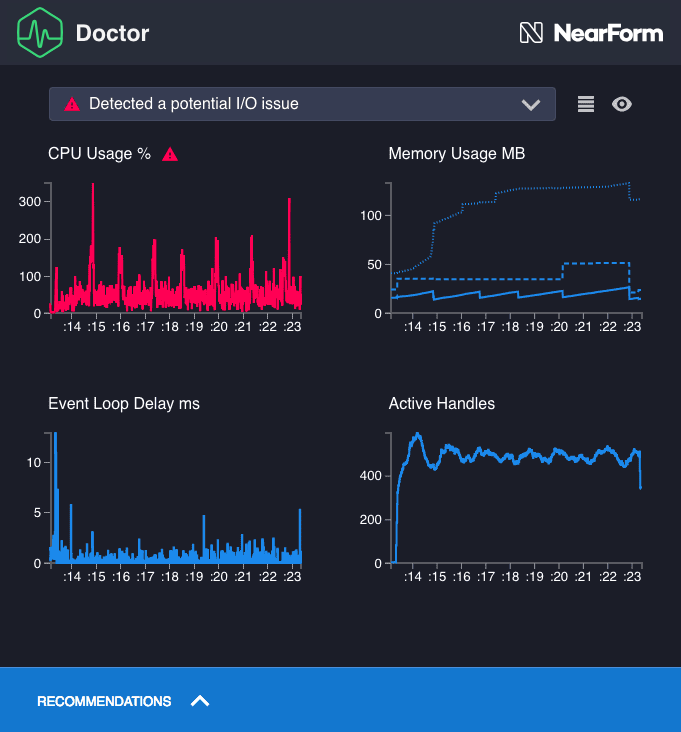

At the start of 2018 [we introduced Clinic.js](https://www.nearform.com/blog/introducing-node-clinic-a-performance-toolkit-for-node-js-developers/), an Open Source toolbox for developers to profile and improve their applications. As part of this toolbox, we launched Doctor, a very user-friendly tool, that uses data analysis to recommend the next steps the user should take to diagnose and fix performance problems in Node.js. And just last month we shipped a new tool, called [Clinic.js Bubbleprof](https://www.nearform.com/blog/introducing-clinic-bubbleprof-a-unique-way-to-visualise-node-js-code/), which specializes in profiling I/O issues.

While we are developing new exciting tools, we are also making a significant effort in improving the existing tools we have. An issue we have noticed during our many workshops, where we teach people to use Clinic.js, is that the way Doctor analyzed the CPU usage wasn’t optimal. Until recently Doctor was using simple statistics to analyze the CPU usage, but now, with the experience we have gathered over the last half year, we have been able to develop much a more advanced Machine Learning model. This model is developed with [TensorFlow.js](https://js.tensorflow.org/). Because TensorFlow.js uses JavaScript, Doctor is just as easy to install as always but is now much more advanced.

<figure>

</figure>

## The Details

An application with an I/O issue typically has a very low CPU usage, because it is spending most of its time being idle. However, what we have noticed is that even applications with I/O issues generate garbage, that the garbage collector will clean up. When the garbage collector runs, it makes the CPU usage spike. If the garbage collector runs often enough, the CPU usage spikes so much that our simple statistical model can no longer see that the CPU usage is too low.

<figure>

<figcaption>
<strong>CPU usage, with GC overlay:</strong> Shows the CPU usage with different types of garbage collection overlayed. Notice, that the alignment isn’t perfect and other events are interfering.
</figcaption>
</figure>

In a simple world, one could just have used information about when garbage collection is happening to filter out the CPU spikes. Unfortunately, the CPU usage data is sample based while the garbage collection data is event-based, which makes it difficult to align the two data sources. From our investigation, it is also clear that other things are going one. Some possible causes could be optimization or writing the logging information itself. All are things that happen in another thread, therefore they make the CPU usage spike to above 100%.

Since it isn’t possible to consistently detect when another thread from V8 within the application makes the CPU usage spike, the solution was to separate the spiky data with Machine Learning. For this, we use a [Hidden Markov Model](https://en.wikipedia.org/wiki/Hidden_Markov_model) (HMM) with [Gaussian](https://en.wikipedia.org/wiki/Normal_distribution) Emissions. The central idea in HMM is that a measurable observation, the CPU usage, is influenced by a hidden unobservable state, is V8 is running an extra thread or not. The [Baum–Welch algorithm](https://en.wikipedia.org/wiki/Baum–Welch_algorithm), allows one to statistically determine what the most likely connection is between the hidden state and the measurable observations. The [Viterbi algorithm](https://en.wikipedia.org/wiki/Viterbi_algorithm) can then infer the hidden state from the measurable observations.

A trainable and inferable implementation of HMM with Gaussian Emissions didn’t exist in the npm register, therefore we ended up implementing it ourselves using [TensorFlow.js](https://js.tensorflow.org/). The implementation is called
[`hidden-markov-model-tf`](https://www.npmjs.com/package/hidden-markov-model-tf) and is available on npm.

It's fully Open Source and the sourcecode is [available here](https://github.com/clinicjs/node-hidden-markov-model-tf).

<figure>

<figcaption>
<strong>CPU usage filtered:</strong> Shows the CPU usage from the user’s application itself, being correctly separated from the CPU usage spikes caused by V8.
</figcaption>
</figure>

Using our implementation of the Hidden Markov Model, it is possible to separate the CPU usage caused by V8 from the CPU usage directly related to the user's application. With this separation in place, it is now possible to detect an I/O issue by checking if the CPU usage of the user’s application is too low.

<figure>

<figcaption>
<strong>Final Result:</strong> The Doctor detects an I/O issues by seeing there is a low CPU usage, even if there are spikes caused by V8.
</figcaption>
</figure>

## Contact

If you would like us to do a workshop, where we teach how to profile and improve the performance of your application. Or if you need Machine Learning applied to some of your data. Then, feel free to contact us at https://www.nearform.com/contact/.
