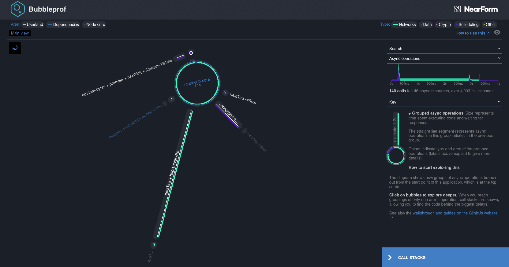
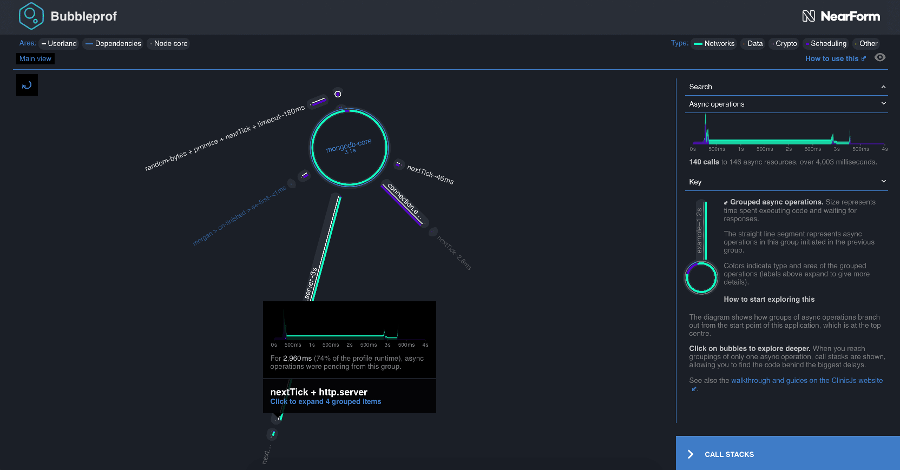
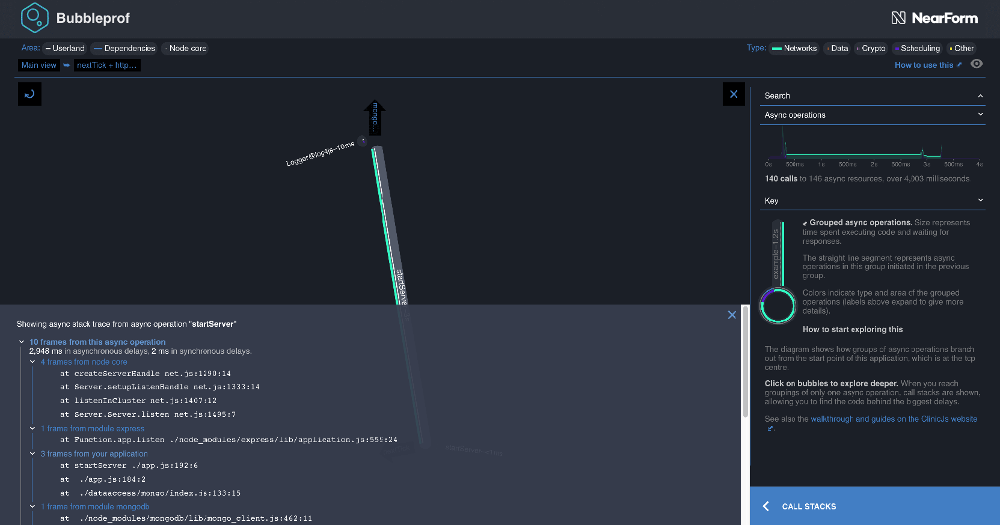
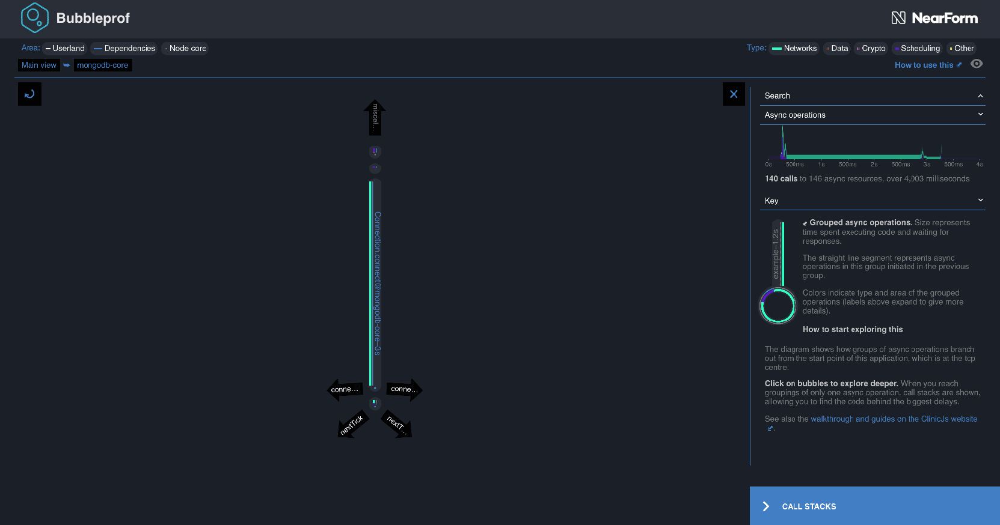
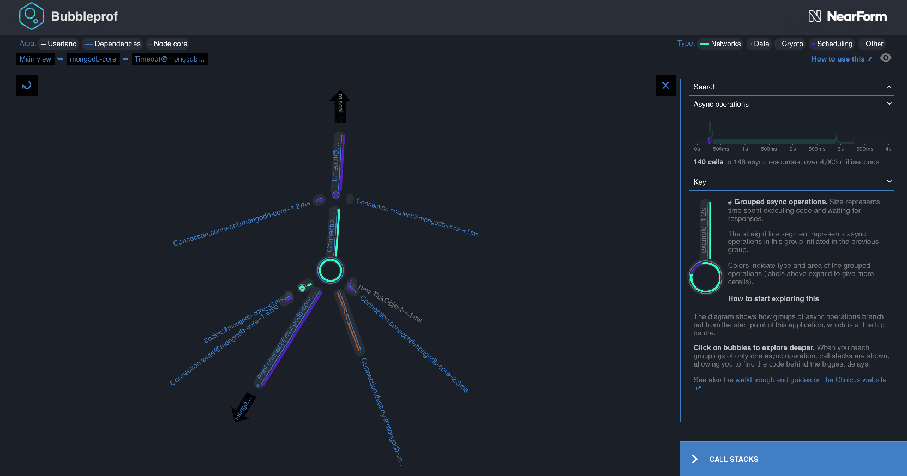

<video src="/assets/videos/bubbleprof-screen-recording.mp4" playsinline loop autoplay muted></video>

Since the beginning of Node, profiling asynchronous operations has been a big
hurdle. After months of internal research we have finally found a solution which
greatly simplifies the process of finding async bottlenecks in Node
applications. Today, we are glad to announce the first public version of Clinic.js
Bubbleprof. Bubbleprof allows developers to capture all async activity with
minimum effort. It then uses a novel "bubble" approach to visualize this
activity. Everything you need is in one HTML file.

You can find it included in the [Clinic.js](http://clinicjs.org/) bundle:

```sh
npm install -g clinic
```

Try it out by cloning our basic Bubbleprof examples from Github:

```sh
git clone git://github.com/clinicjs/node-clinic-bubbleprof-examples
```

Start simple and run the `basic-latency` example, which visualizes how a latency
of 1s affects your server:

```sh
clinic bubbleprof --on-port ‘autocannon localhost:$PORT’ -- node node-clinic-bubbleprof-examples/basic-latency
```

Notice the long lines of latency? That’s a quick way of finding something to
improve in the app.

## Traditional Async Profiling

Node works best in heavily-I/O-related contexts, and often acts as a mediator
between many data streams and interfaces. Due to JavaScript’s evented nature,
most I/O is performed asynchronously – especially when our Node process is a
networked application. If we can measure asynchronous activity in a decoupled
way, we can find out where an application is waiting. Finding out where an
application is waiting means finding out where to optimise our asynchronous
flow. The end result being that our application becomes faster, and our users
happier.

Tracking and profiling asynchronous is a tricky issue. Consider the following
simple example:

```js
setTimeout(crash, 1000) // maybe crash after 1s
setTimeout(crash, 1000) // call it again

function crash () {
  if (Math.random() < 0.5) {
    throw new Error(‘an async error’)
  }
}
```

Running the above program will (probably) crash our Node.js process with a stack
like this:

```
set-timeout-crash.js:5
  throw new Error('an async error')
  ^

Error: an async error
    at Timeout.crash [as _onTimeout] (set-timeout-crash.js:5:9)
    at ontimeout (timers.js:466:11)
    at tryOnTimeout (timers.js:304:5)
    at Timer.listOnTimeout (timers.js:267:5)
```

Figuring out which one of the `setTimeout`s triggered the crash is a
surprisingly hard problem. The stack trace only contains the last synchronous
part of our application. If we want to not just figure out what crashed the
program but also profile how many times the async function is called and from
where we would run into similar problems.

This is not a new problem in Node.js, but in fact one that’s been around since
the very beginning. Lots of solutions have been attempted for making the
situation better in regards to capturing longer stack traces and measure runtime
of functions. Most older solutions did things like rewrite all your code that
does something async to capture a stack trace before and then combine them back
to produce a “full” trace. This requires plenty of “monkey patching” and is
known for being brittle and have a substantial negative performance effect - it
would often de-optimise your code because of too much reflection.

## Enter node core instrumentation

Luckily the Node.js core collaborators have been trying hard to make the
diagnostic situation better for everyone by adding more instrumentation to the
Node.js core codebase. In fact, all async code (excluding native modules) is
actually triggered from Node.js core which means that the situation has to
improve there for userland to get any benefit. Some of the new instrumentation
that has landed recently is the new `async_hooks` core module. `async_hooks` is
an interface to a new set of instrumentation in core that instruments any async
operation. This means that we now have a way to hook into _when_ something async
happens and also a way to find out what the _parent_ async operation was. This
is a massive improvement in the profiling landscape as it means we can now get a
ton of valuable timing data out of Node.js core without having to resort to a
bunch of hacks.

If we add some `async_hooks` magic to our previous example, then we can figure
out which of the `setTimeout`s made our program crash:

```js
const hooks = require('async_hooks')
const stacks = []

hooks
  .createHook({
    // save the stack when we do something async
    init: (id, type, trigger) => (stacks[id] = new Error('error').stack)
  })
  .enable()

setTimeout(crash, 1000) // maybe crash after 1s
setTimeout(crash, 1000) // call it again

function crash() {
  if (Math.random() < 0.5) {
    // lookup the previous stack
    console.log(stacks[hooks.executionAsyncId()])
    throw new Error('an async error')
  }
}
```

Running it will show something similar to this:

```
    at AsyncHook.init
    …
(set-timeout-crash-hook.js:11:1)
    ...
Error: an async error
    at Timeout.crash [as _onTimeout] (set-timeout-crash-hook.js:17:11)
    at ontimeout (timers.js:466:11)
    at tryOnTimeout (timers.js:304:5)
    at Timer.listOnTimeout (timers.js:267:5)
```

Which tells us that this time it was the timeout at line 11 (first one) that
triggered the crash.

In addition to letting us capture the async context async_hooks gives us
valuable insights into latency stats, throughput, the type of resource, and
more.

## Reducing complexity

`async_hooks` and other new core instrumentation give us a new waterhose of
profiling data in Node.js. This is essential for doing any kind of profiling but
also poses an interesting challenge. How do we digest this data in a way that
helps us diagnose bottlenecks and/or find errors in our application? This, of
course, is a non-trivial problem and depends on the use-case we are trying to
support.

This is why we’ve started building Bubbleprof, a new command in the
[Clinic.js](https://github.com/clinicjs/node-clinic) toolchain. Bubbleprof uses a
series of heuristics and a novel “bubble” based UI to help all kinds of users -
from beginners to advanced - to determine where asynchronous time is spent in
their application.

Through a series of design workshops we’ve come up with a couple of heuristics
we think help group async data together in a way that makes it easy to get an
overview over your application.

There are 3 interesting groupings of code in your Node.js application:

- "User code", ie. code you are writing as part of your app.
- "Module code", code running in modules you have installed from npm
- "Node core code", code running in Node.js core.

When code crosses the boundary between one of these groupings, we consider it
important information that can help us group asynchronous operations together.
Bubbleprof tries to collect and aggregate _all_ async operations (using
`async_hooks`) and then group them into bubbles based on this heuristic.

## Visualizing async flow

Now that we have a manageable number of groupings - instead of hundreds or
thousands of distinct async operations - we can draw a diagram that acts like a
map of an application's async flow, showing where time is spent. For example, in
this profile based on ACMEair (a dummy flight data application designed for use
in benchmarking), we immediately see a flow centered around the database module
MongoDB:



[Live example](/assets/html/bubbleprof-example.html)

### Bubbles and links

These "bubbles" represent the time spent in synchronous and asynchronous
operations within this grouping. The largest bubble in the view represents calls
from the `mongodb-core`, which calls other functions elsewhere in the `mongodb`
code. It dwarves every other bubble, which compared to it are tiny dots, and
much of the application branches off from it. Clearly, optimising how this
application uses `mongodb` has a lot of potential to reduce overhead and trigger
other async operations earlier. The dominating green colouring in the inner ring
tells us that most of this time is spent on network-related activities, while
the small sliver of purple indicates some time spent in scheduling (ticks,
timeouts and promises). Rolling the mouse over the labels for these colours
gives us information on what they mean and highlights the appropriate parts of
the diagram.

There is also a very long line to a tiny bubble labelled `nextTick + http.server`. A thin white stripe tells us that this is code from our own
application. Connecting lines like this one represent asynchronous delays from
operations that were called in one grouping (here, the `mongodb` module), but
execute code in another (here, some of our application's own code which involves
an `http` server and `nextTick` wrappers). This suggests another area for us to
focus on: our own code, which might be a quick win.



[Live example](/assets/html/bubbleprof-example.html)

### Drilling down to code

We can click into these links and bubbles to see what is going on inside them.
Clicking on the line shows something very simple: `startServer` is responsible
for almost all of the delay in this grouping. Clicking again brings up the stack
trace; and also - because context here is important - the complete async trace
of the chain of events from our application's initiation to this point.



[Live example](/assets/html/bubbleprof-example.html#a49)

Because these traces can be very long, we group adjacent frames from the same
section of code, automatically expanding those from the user's own application.
In this example, `startServer` at line 192 of our `app.js` called the `express`
module, which invoked a number of operations in node core, with
`createServerHandle` being the last one. This was called from the `mongodb`
client.

Looking at the area chart on the right, we see that this was pending for most of
the runtime of our application. Is this a slow server we want to optimise, or a
healthy service constantly awaiting requests? We can check our application code
and find out.

We can click the upwards-pointing arrow labelled "Mongo..." to navigate up into
that big, `mongodb-core` bubble. The view inside it also very simple - dominated
by `Connection.connect`, called from within `node_modules/mongodb-core`.



[Live example](/assets/html/bubbleprof-example.html#c3)

### Navigating async complexity

So what about the parts of our `mongodb` integration that are fast? If we click
the small topmost grouping, it expands out into another more complex layout.
These tiny, extremely short async operations would have been too small to be
useful information in the previous view, so Bubbleprof has collapsed them
together.



[Live example](/assets/html/bubbleprof-example.html#lclump:A10,A11,A12,A13,A14,A15,A16,A17,A18,A19,A20,A21|c3)

Exploring this view, we see activity mostly relating to database connection
pools and sockets. Everything looks fine in terms of speed, and we can use these
maps of how processes execute in series and parallel to better understand the
module's flow, diagnose timing bugs, spot operations in series that could be
more efficient in parrallel, and identify unnecessary steps that can be
optimised away.

This is just a simple example. You can use Bubbleprof with benchmarking tools
like Autocannon or Wrk to generate robust performance profiles, and see the
changes in your application's throughput and flow as you try things out. We have
a
[simple step-by-step walkthrough guide](/documentation/bubbleprof/)
to help you get started.

### Get Started

We'd love for you to install and try out Bubbleprof to see how it can help get
to the bottom of your Node.js performance issues.

Head over [to the walkthrough](/documentation/bubbleprof/) and you'll be up and
running in minutes.

We'd also love to get your feedback on Bubbleprof/Doctor/Flame and the outputs
they generate. In this early phase of release, we're eager to have it used on as
many real-world problems as possible.

We welcome everyone who is interested in becoming part of our community. If
you'd like to get involved in any aspect, not just code, first read our
[Code of Conduct](https://github.com/clinicjs/node-clinic/blob/master/CODE_OF_CONDUCT.md)
and
[Contributor guide](https://github.com/clinicjs/node-clinic/blob/master/CONTRIBUTING.md).
Then feel free to reach out to us on GitHub or via the usual social channels.
