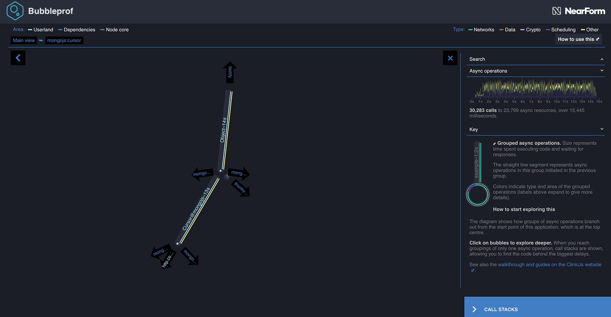
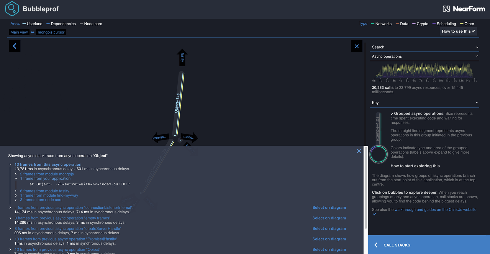

# Bubbles

Let's dive into what these mean and how to interpret them.

- A bubble represents a group of async operations.
- The more time spent within a group of async operations, the bigger the bubble is.
- The longer the lines between bubbles, the more latency exists between them.

The way bubbles group together async time is based on a couple of heuristics.

Profiled code is grouped into 3 areas - _userland_ (the application being profiled), _dependencies_ (3rd party modules), and _node core_.

Whenever an async operation crosses from one space into another it defines the boundary of a bubble.

Clicking on a bubble steps inside it to show the bubbles it's composed of.

For example, try clicking on the yellow bubble at the bottom called mongojs. The UI tells us it contains userland code as well
as it has a lightblue color.



In here we see that there are two smaller bubbles. If we click on the first one it'll show the stack trace
for the operation that created this as it has no sub bubbles.



This stack trace is actually a combined stack trace by multiple async operations. The userland code is highlighted
to help you navigate to your code that triggered this bubble. In this case it tells us that it was from line 10
in `1-server-with-no-index.js`.

If we look into the source file we'll see that line 10 looks like this:

```js
col.find().sort({modified: -1}).limit(5, function (err, newest) {
```

Which makes sense, as this is a mongodb query. In fact if we look at the other yellow bubble on the page,
we'll see that it contains a reference to the next query inside its callback. This link indicates
that these bubbles are executed in series.

---

##### Up next

[Sidebar](/documentation/bubbleprof/05-sidebar/)
