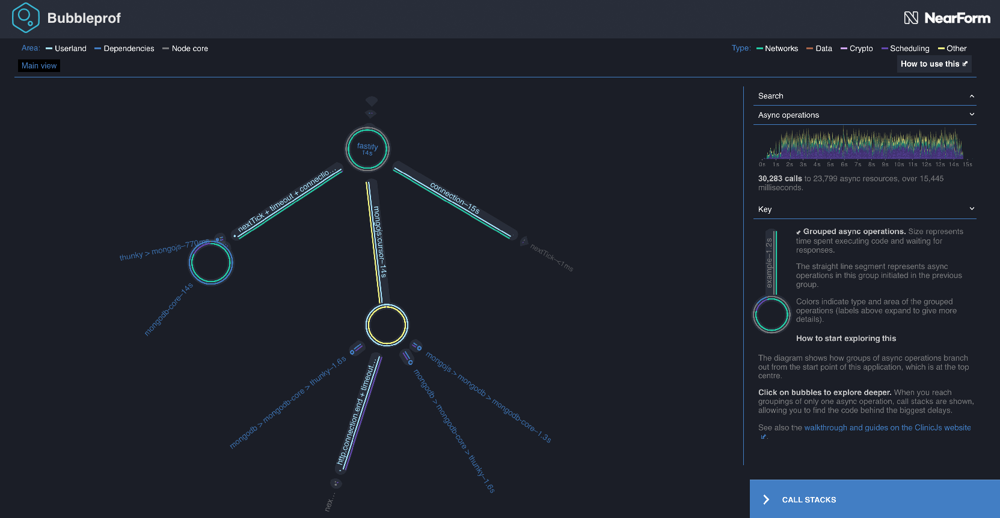

# The sidebar

So the bubbles show an overview on where time is spent. To get an idea on how much time is spent in general
you can inspect the sidebar.

Try going back to the Main View. You can use `backspace` on your keyboard to step back, or use the on-screen controls.
On the right side of screen you should see a sidebar similar to this one:

In the top of the sidebar there are two important sections.

1. A search bar that allows you to search the data to find a specific function call.
1. A timeline that shows the async activity over time.

Timeline is very useful at examining throughput and that could give us a clue where the first bottleneck could be found.

---

##### Up next

[Finding the first bottleneck](/documentation/bubbleprof/06-finding-the-first-bottleneck/)
