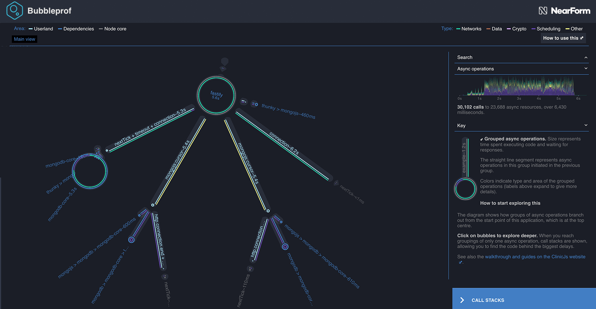

# Parallel queries

The third example, `3-server-with-index-in-parallel.js` is similar to second example, but executes the queries
in parallel. Let's profile it again.

```bash
clinic bubbleprof --on-port 'autocannon -c 5 -a 500 localhost:$PORT' -- node 3-server-with-index-in-parallel.js
```



Now instead of having a simple mongodb query bubble we have two tiny ones each flanking our fastify
bubble on the top. This is much better as it means we are doing more async operations in parallel.

Once again we can see a drop in the total times by further one third. This is reflected both in the bubbles and the timeline.

As it stands, this bubble layout is close to optimal. We have almost no userland code taking up any time anymore,
which means most time is spent in 3rd party modules - which we assume to be pretty optimal for their usecase
as well.

The main way to improve this now, would be to get rid of the mongodb bubble or fastify bubble entirely. Getting rid of fastify would be
hard as our application is a http server and fastify is already really good at doing http stuff. To get rid of the mongodb bubble we would
have to do fewer things with the database.

---

##### Up next

[Caching the results](/documentation/bubbleprof/09-caching-the-results/)
