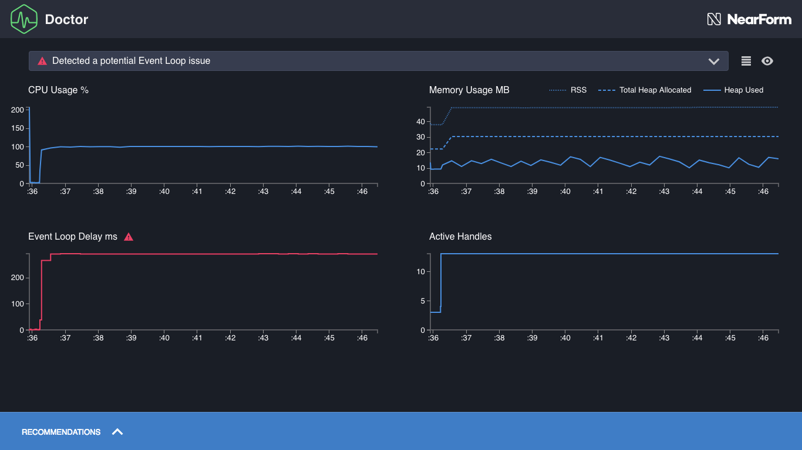

# First analysis

We're now ready to profile one of the example applications. For the first
example, we will use `slow-event-loop`. First, let's confirm that it is ready and
working by running `node slow-event-loop` from inside the `examples` directory.
Once the process seems to be running we can visit <http://localhost:3000/> in a browser to check.

We should see some basic output in the browser, like `{}`. Ctrl-C in the
command line to close the `slow-event-loop` server.

This is a server, so we need to apply load. Profiling a server handling
just one request doesn't give us much data or indication of how it performs
when handling many requests. We recommend the benchmarking
tool [Autocannon](https://www.npmjs.com/package/autocannon).

We will execute `autocannon` in the example application directories when
we call the `clinic` executable, so let's install it globally, with the
following command:

```
npm install -g autocannon
```

To load-test the server, we want to run it with Doctor, and point
`autocannon` at it as soon as it starts listening on a port. This will
bombard the server with requests, as soon as it is ready to handle them
and Doctor is ready to collect data.

Let's do all that with this single command, which automatically assigns
the correct ports:

```
clinic doctor --on-port 'autocannon localhost:$PORT' -- node slow-event-loop
```

Let's break this command down:

- The `clinic doctor` portion invokes the Doctor command tool.
- The `--on-port` flag will execute the supplied script as soon as the server starts
  listening on a port.
- The `$PORT` variable in that script is set to the first port that the server began
  listening on.
- Everything after the double-dash (`--`) is the command which starts the server that
  we want to profile, in this case `node slow-event-loop`.

This one command runs three executables: the `clinic doctor` parent executable, the
`autocannon` executable in `--on-port` and the `node` executable.

Upon running the command, the `slow-event-loop` server will be hit by requests from
10 concurrent connections for 10 seconds (as per `autocannon` defaults).
then the results be compiled into a single HTML file that should automatically
open in the browser.

The resulting HTML should look similar to the following:



---

##### Up next

[Reading a profile](/documentation/doctor/04-reading-a-profile/)
