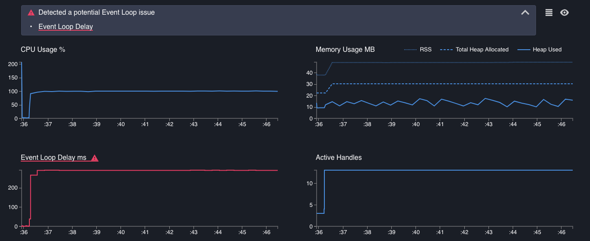
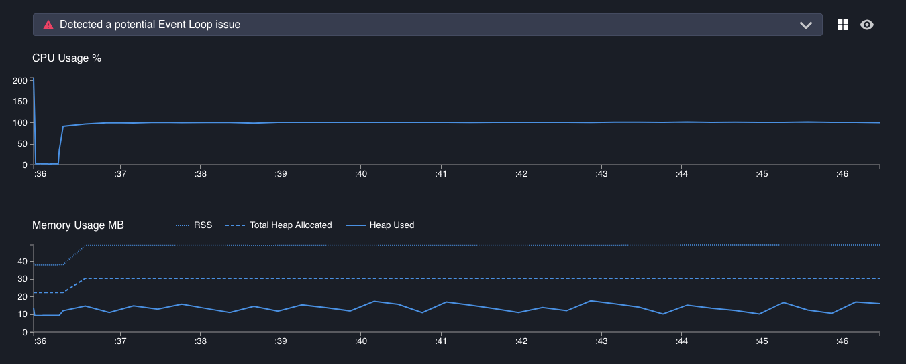
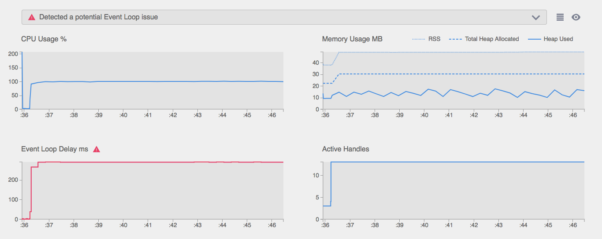
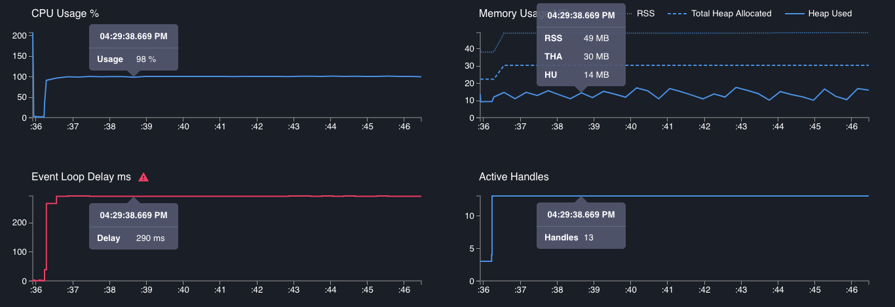
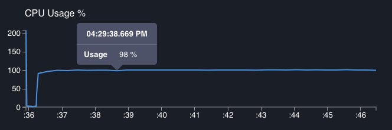
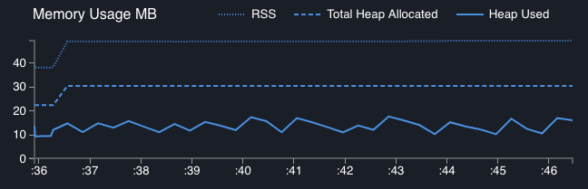
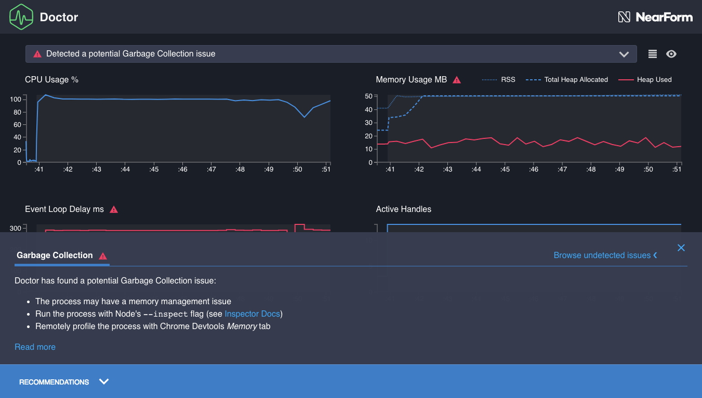
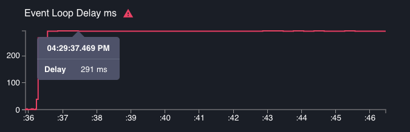
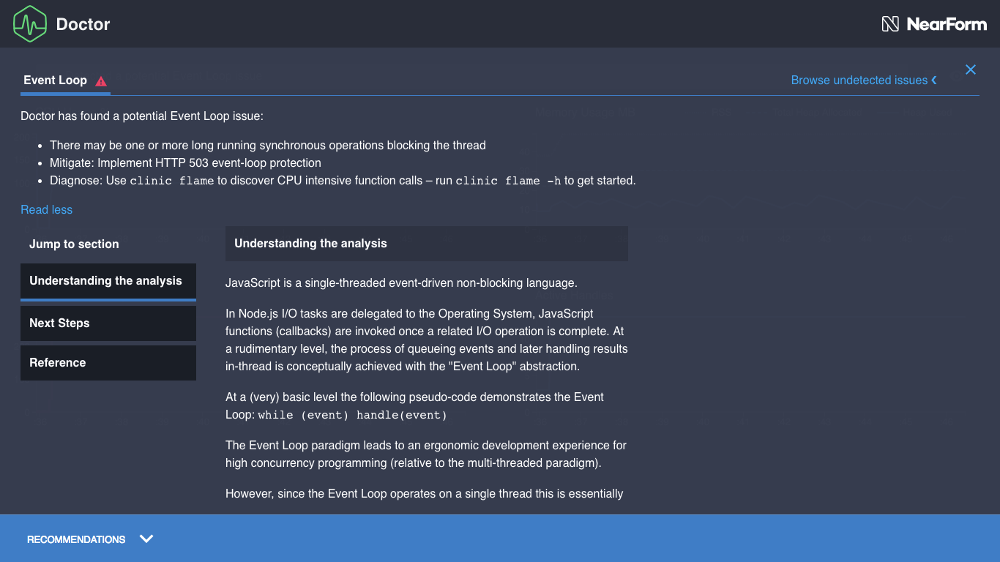

# Reading a profile

The Clinic.js Doctor profile has three main sections:

- **Alert Bar**: Points us towards the main problem, if there is one. Also contains **View Controls**.
- **Graphs**: Plot the data from which Doctor is drawing its conclusions
- **Recommendations Panel**: Detailed explanation of the problem with next steps

## Alert Bar

Click on this to open it out, and we see a one-line summary of the main problem, if
there is one. Hover over this summary and it will underline the title of the specific
graph that Doctor thinks is most relevant to understanding the problem.

Doctor does not generally identify more than one issue, so there will generally be either one
problem here, or a note that no problems were found. This is because one performance problem
can disrupt the data needed to diagnose another problem. For example, if Doctor is sure there
is an event loop problem, it might not be able to take enough readings to judge if there
is an I/O problem.

A first-time user will mainly use the Alert Bar to see if there is a detected problem or not,
before going straight to the description in the Recommendations Panel to understand it better.
A more experienced user will recognise common detected problems and then study the appropriate
graphs for clues about how this particular example of the problem is manefesting itself.

In the above example, Doctor is telling us that it has detected a problem, and the problem is
"a potential Event Loop issue", which can be seen in the Event Loop Delay graph:

#### View controls

To the right of the Alert Bar there are two buttons to change the view:

-  **Grid
  View / List View.** By default, Doctor shows all graphs in a grid so they can all be seen on the screen
  at once. This button switches to a List View where each graph takes the full width of the screen.
  This can be useful for advanced users who might want to study the detail of the graphs.
  When in List View, clicking on the problem described in the Alert Bar scrolls
  the page down to the most relevant graph, if it is not in view.

-  **Light
  Theme / Dark Theme.** By default, Doctor uses a theme with a dark background and light text. This is
  good for reducing glare, but some in situations (or for some individual preferences), a theme with
  a light background and dark text is better. For example, we will probably want to switch to
  the Light Theme when taking screenshots that will be printed on paper, or when projecting
  a Doctor profile in a well-lit room where the dark theme is hard to read.

## Graphs

These plot various variables used in Doctor's analysis over time, from the start time of the profile
(left end of the X-axis) to the finish time (right end of the X-axis).

All graphs use the same X-axis. We will see that hovering over one shows the values at the same
point in time on all the other graphs.

#### CPU Usage %

This graph shows what percentage of the machine's available CPU capacity was being used by the
Node.js process being profiled at any one point in time.

_CPU Usage can exceed 100%_ if the machine has multiple cores. 100% on this graph means
100% of the capacity of a single core.

Spikes in this graph indicate high CPU activity. This can be a problem if it is excessive and
correlates with event loop blockage (see below), but rapid spikes can be a sign that the server
is healthily processing high load quickly. Too little CPU activity can be a sign that the Node.js
process is stuck waiting for an I/O operation to complete, like a slow database query or file write.

In this profile, the processor is usually fairly busy, which looks healthy.

In part 6 of this walkthrough, [Fixing an I/O problem](/documentation/doctor/06-fixing-io-problem/),
we will see an example of an unhealthy CPU Usage graph.

#### Memory Usage MB

This graph has three lines, showing megabytes of memory at each point in time, all on the same
scale.

The three lines are:

- **RSS (Resident Set Size)**: This will always be the highest value, representing all memory
  allocated as part of the execution of this process. The gap between this line and the Total Heap
  Allocated line represents non-heap memory, such as storing of the JS code itself, the "stack"
  which contains variable pointers and primitives like boolean and integer states, and a memory pool
  for [Buffer](https://nodejs.org/api/buffer.html) contents.
- **THA (Total Heap Allocated)**: This is the amount of space that has been set aside for storing
  items that have a reference, such as strings, objects and function closures. Unlike the stack,
  where the reference pointers to these items are stored, a pre-set amount of memory is assigned
  for the heap, before it is needed.
- **HU (Heap Used)**: This is how much heap memory is actually being used at this point. It
  represents the total size of all strings, objects, closures etc that have been allocated but
  not garbage collected at a given point in time. **This is usually the most interesting line**,
  with RSS and Total Heap Allocated providing context.

A constantly increasing Heap Used line suggests a possible memory leak, where references to
something are remaining in-scope, meaning it can't ever be garbage collected and therefore
causing available memory to eventually run dry. The opposite is perhaps a more common problem:
many sharp drops, correlating with high readings in the Event Loop Delay graph, suggests that
disruptive garbage collection events are disrupting the process and blocking
Node.js from executing code.

In this profile, the heap goes up and down fairly gradually, there is always plenty of spare
heap allocation, and there is plenty of non-heap memory in the Resident Set as well. This looks healthy.

If we encounter an unhealthy Memory graph, the specific line indicating a problem will be marked
in red:

#### Event Loop Delay ms

This represents points in time in which Node.js was blocked by executing synchronous
JavaScript code.

It is important that we understand how this graph works, because it
also gives us information about the acuity of the other graphs:

- The Y-axis represents the duration of the event loop delay that ended at the moment in
  time indicated by the tooltip arrow
- This is then always followed by a horizontal line representing the same amount of time on
  the X-axis. For the length of this line, **Node.js was blocked**, therefore, we don't have
  any data on _any_ graphs. If we run the cursor along a graph containing
  substantial event loop delay, the tooltip jumps - this is because no data could be
  collected between the jumps, for any graphs, because Node.js was stuck executing some
  slow synchronous code.

For example, in the below screenshot, we can see:

- That this is the (joint) longest event loop delay seen in this profile, because it is the
  highest point on the Y-axis.
- That this delay took up a noticable chunk of the duration of the profile, by looking at the
  horizontal line between this tooltip and the previous one.

Moving the cursor along, we can see that four event loop delays account for most of the
run time. We can also see that this is causing the other data to be very course - after
the first quarter of a second or so, there are noticable jumps between each reading for
memory, CPU, etc, because Node.js was too busy executing some slow synchronous code to
even take another reading.

This is clearly not healthy - and Doctor has flagged it as such, colouring this graph
red and pointing to it in the Alert box.

#### Active Handles

This graph shows the quantity of I/O handles presently active, awaiting an output.

When Node.js delegates asychronously, such as using [libuv](https://libuv.org/) to delegate
a task like a file write or a database query the operating system, it stores a "handle". An
"active handle" is a delegated task that has not reported as being complete.

The Active Handles graph therefore gives us an idea of how much asychronous I/O activity
the Node.js process is waiting on at any point in time. This should ideally follow an
orderly pattern, rising and falling as requests are handled and completed. It can also
offer clues when combined with the other graphs - for example, CPU spikes on a server
that correlate with increased active handles should usually also correlate with
incoming requests.

This graph generally provides context for the other graphs. It's hard to say generically
what an Active Handles graph "should" look like: we generally can't point to an Active
Handles graph and say "That looks unhealthy" without knowing the application logic.

Here, we have a period with very few active handles, and very little other activity, which
presumably represents the process getting ready. There is then a steady period of [103]
active handles, which presumably represents incoming requests being dealt with. It tells
us we can probably ignore that early period with very few active handles as not
representing typical server activity.

## Recommendations Panel

Click on the blue bar at the bottom, and it will open a panel telling us more about Doctor's
conclusions about what is happening with this application.

This is in two parts: a Recommendations Summary, and a Recommendation in Detail article
below a 'Read more' button.

#### Recommendations Summary

This gives a simple bullet point overview of the identified problem, typically with a
suggested next step.

There are a few UI controls:

- The 'x' closes the panel
- "Browse undetected issues" allows us to read descriptions of issues that Doctor can
  identify but hasn't identified for this profile. Clicking on this expands out some tabs
  to show descriptions of problems that Doctor has not identified for this profile. For example,
  We might find this useful, for example:
  - While learning about Node.js performance, to avoid creating new problems while fixing
    an existing problem.
  - To understand why Doctor might not have identified a known problem. As discussed in
    the [Alert Bar section](#alert-bar), Doctor generally does not diagnose more than one problem at a time.

In this case, it tells us that "There may be one or more long running synchronous operations
blocking the thread", and recommends using `clinic flame` to narrow down.

After reading the summary, we recommend clicking "Read more" to understand the problem
in more depth.

#### Recommendation in Detail

Clicking 'Read more' expands the Recommendations Panel to show a detailed article on the
performance problem that has been diagnosed. These usually have three sections (clicking
on the contents list on the left allows us to skip to a particular section):

- **Understanding the analysis** describes the problem in depth.
- **Next Steps** details some recommended steps to narrow down on the exact cause of
  the problem, so we can fix it. Usually this involves using another tool in the Clinic.js
  suite which can identify individual lines of problematic code.
- **Reference** gives links for suggested further reading and credits any sources that
  were quoted or used in writing this recommendation.

Then we're ready to look at fixing the problem.

---

##### Up next

[Fixing an event loop problem](/documentation/doctor/05-fixing-event-loop-problem)
