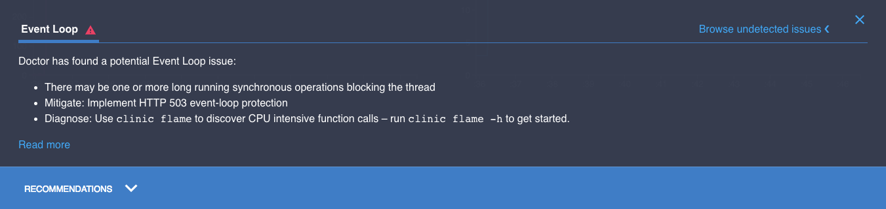
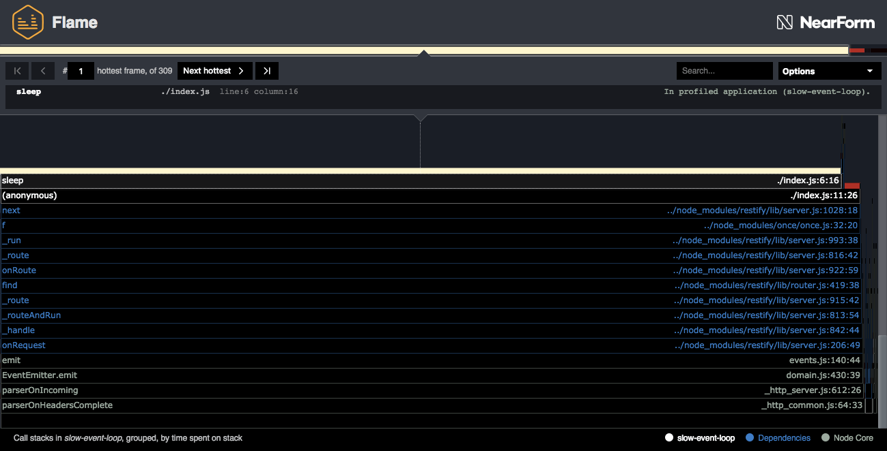
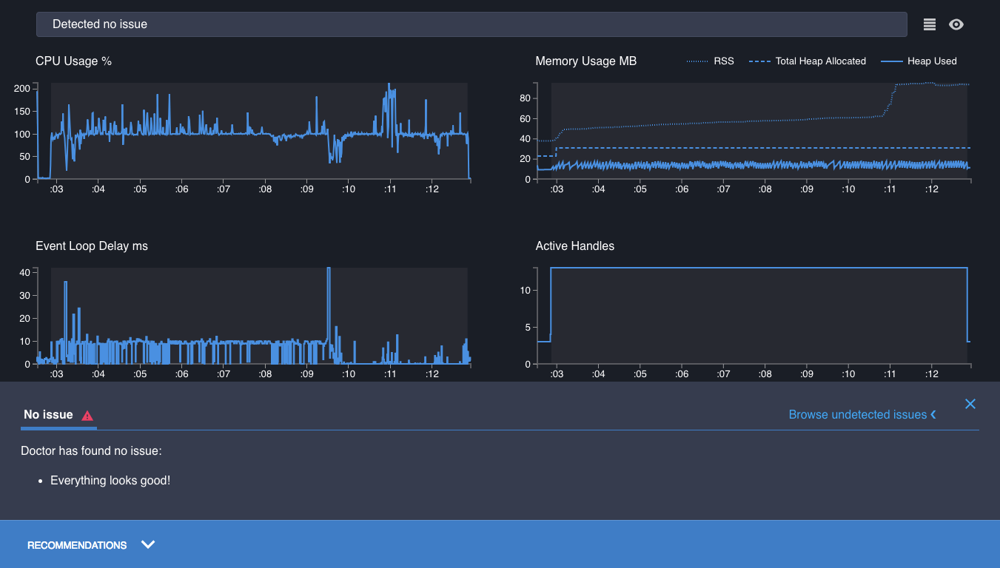

# Fixing an event loop problem

In [Reading A Profile](/documentation/doctor/04-reading-a-profile/), we saw how to understand the
information Doctor is giving us, and why it recommends what it does. Now we'll look at fixing the problems.

## Consulting the Doctor

We've already read the profile we created in
[First Analysis](/documentation/doctor/03-first-analysis/), from the `slow-event-loop`
example server in `node-clinic-doctor-examples`. We were told that our problem was slow synchronous
code [blocking the event loop](/documentation/doctor/04-reading-a-profile/#event-loop-delay-ms/),
and Doctor recommended using `clinic flame` to identify the problem.



## Following the prescription

We can create a Flame profile with a command that is the same as for Doctor,
but swapping `flame` in for `doctor`:

```sh
clinic flame --on-port 'autocannon localhost:$PORT' -- node slow-event-loop
```

Our output looks something like this:



Clinic.js Flame by default selects the function call that spends most time blocking
the event loop, and has identified that the function spending the most time blocking
the event loop is `sleep`, on line 12 of `slow-event-loop/index.js`.

`node-clinic-doctor-examples` uses very simple example servers: for
this example, we don't need to dig deeper into the diagram or advanced features
detailed in the [Clinic.js Flame documentation walkthrough](/documentation/flame/).

We can immediately open up `index.js` and look for fixable bottlenecks in the
line Flame has picked out:

```js
server.get('/', function(req, res, next) {
  sleep(30)
  res.send({})
  next()
})
```

That `sleep(30)` call is the one flame picked out. Let's see what this `sleep` function does:

```js
function sleep(ms) {
  const future = Date.now() + ms
  while (Date.now() < future);
}
```

It's clear why this is causing an event loop delay.

The event loop is single-threaded: only one operation is processed at a time. Each
request to this server queues a synchronous function on the event loop containing
a `while` loop which will repeatedly iterate for 30 milliseconds. Each of these blocks
the event loop: the single thread is busy iterating the `while` loop, unable to process
any other operations.

If the pause was from an asynchronous timeout, like from `setTimeout`, the event loop
would not be blocked. The synchronous code containing `setTimeout` would continue and
complete, and then the callback function passed to `setTimeout` would be called in a
separate, future tick of the event loop.

This `sleep` function, however, is entirely synchronous. The event loop is blocked
until it completes.

## Curing the ailment

Let's reduce the duration of the loops, changing the arg passed to `sleep` to `1`:

```js
server.get('/', function (req, res, next) {
  sleep(1)
```

...save, and recreate the profile:

```sh
clinic doctor --on-port 'autocannon localhost:$PORT' -- node slow-event-loop
```

The profile now detects no issues. Everything is blue, the graphs look healthy and Doctor's
Recommendations Panel is cheerfully telling us that "Everything looks good!".



This is a very simple example server. In a more complex application, we would normally
need to explore the Clinic.js Flame profile further to hone in on the cause or causes of the
bottleneck. Detailed examples of how to do this are available in the
[Clinic.js Flame documentation](/documentation/flame/).

---

##### Up next

[Fixing an I/O problem](/documentation/doctor/06-fixing-io-problem/)
