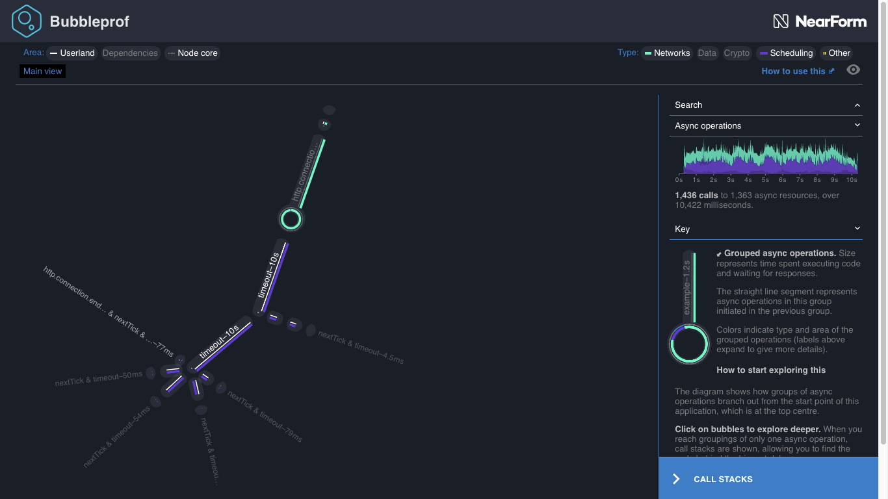
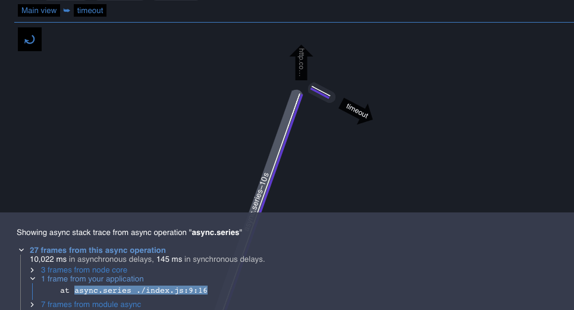
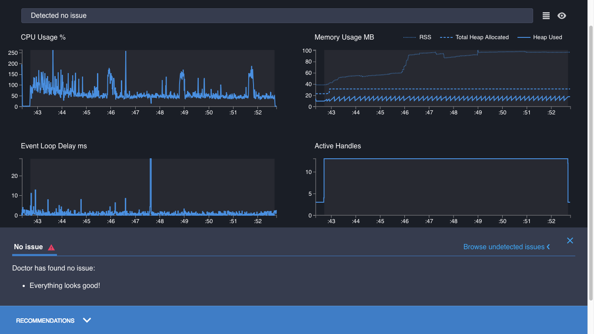

# Fixing an I/O problem

In [Reading A Profile](/documentation/doctor/04-reading-a-profile/), we saw that the CPU Usage
graph can indicate problems with Node.js I/O (Input/Output) operations delegated to other processes,
such as slow database queries or file writes delegated by [libuv](https://libuv.org/)).
Let's look at that in more detail with an example.

## Consulting the Doctor

There is an example server for this problem in `node-clinic-doctor-examples`, called `slow-io`.
Assuming we have everything set up as described in
[Getting Ready](/documentation/doctor/02-getting-ready/) and
[First Analysis](/documentation/doctor/03-first-analysis/), let's
create a Clinic.js Doctor profile from that server:

```sh
clinic doctor --on-port 'autocannon localhost:$PORT' -- node slow-io
```

The output should look something like this:


The CPU Usage graph is highlighted in red. It shows several spikes, but is mostly low.
There is less CPU activity than we'd expect from a busy server. The Recommendations Panel
explains that this is likely caused by slow _asynchronous_ operations: our application
is waiting for external I/O to resolve promises or trigger callbacks.

This is a very different problem to the one we saw while
[Fixing an event loop problem](/documentation/doctor/05-fixing-event-loop-problem/).
The Recommendations Panel advises that we use another Clinic.js tool, `clinic bubbleprof`.

## Following the prescription

We can create a Bubbleprof profile with a command that is the same as for Doctor,
but swapping `bubbleprof` in for `doctor`:

```sh
clinic bubbleprof --on-port 'autocannon localhost:$PORT' -- node slow-io
```

Our output looks something like this:



`node-clinic-doctor-examples` uses very simple example servers, so for now
we'll only need to look at the main diagram, not the more advanced features
detailed in the [Clinic.js Bubbleprof documentation walkthrough](/documentation/bubbleprof/).

The main diagram shows a busy `http.connection`, calling a `timeout`, which then calls
more `timeout`s in parrallel. That first `timeout` looks key - the rest of the application
branches off from it.

It could be our bottleneck.

Clicking on it opens it out to show two parts. Clicking on the longer part points us to some code:
a function `async.series`, in our application, file `./index.js`, line 9, column 16:



If we open `node-clinic-doctor-examples/slow-io/index.js` and find that line, we see:

```js
function awaitData(callback) {
  async.series(
    [
      done1 => setTimeout(done1, Math.random() * 1000),
      done1 =>
        async.parallel(
          [
            done2 => setTimeout(done2, Math.random() * 1000),
            done2 => setTimeout(done2, Math.random() * 1000),
            done2 => setTimeout(done2, Math.random() * 1000),
            done2 => setTimeout(done2, Math.random() * 1000),
            done2 => setTimeout(done2, Math.random() * 1000)
          ],
          done1
        )
    ],
    callback
  )
}
```

This is what Node.js is waiting on - chained timeouts.

If the delay was an external process like a slow database query, the clues visible to
us within Node.js would be the same. We can't see what exactly is happening within the external
operation, but we can identify _which_ asynchronous operation Node.js is waiting for.

## Curing the ailment

Let's reduce the duration of the timeouts, changing the second argument passed to `setTimeout` from `1000` to `1`.
This simulates dramatically speeding up the external I/O:

```js
function awaitData(callback) {
  async.series(
    [
      done1 => setTimeout(done1, 1),
      done1 =>
        async.parallel(
          [
            done2 => setTimeout(done2, 1),
            done2 => setTimeout(done2, 1),
            done2 => setTimeout(done2, 1),
            done2 => setTimeout(done2, 1),
            done2 => setTimeout(done2, 1)
          ],
          done1
        )
    ],
    callback
  )
}
```

We then save, and recreate the profile:

```sh
clinic doctor --on-port 'autocannon localhost:$PORT' -- node slow-io
```

The profile now detects no issues. Everything is blue, the graphs look healthy,
the CPU is active, and Doctor's Recommendations Panel is cheerfully telling us
that "Everything looks good!".



This is a very simple example server. In a more complex application, we would normally
need to explore the Clinic.js Bubbleprof profile deeper to hone in on the cause or causes of
the bottleneck. Detailed examples of how to do this are available in the
[Clinic.js Bubbleprof documentation](/documentation/bubbleprof/).

---

##### Up next

We're now familiar with how to use Doctor to identify the type of problem. The next step is learning
more about those tools we can use to hone in on specific code.

We're now ready to move on to the walkthrough documentation for:

- [Clinic.js Flame](/documentation/flame/), for identifying slow synchronous code
- [Clinic.js Bubbleprof](/documentation/bubbleprof/), for finding problems in asynchronous code
