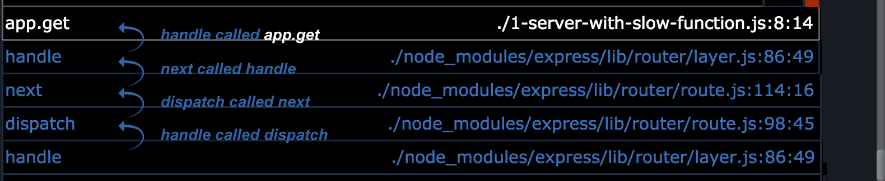
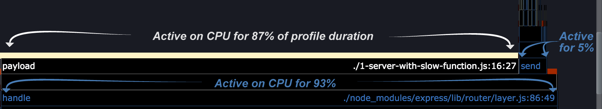
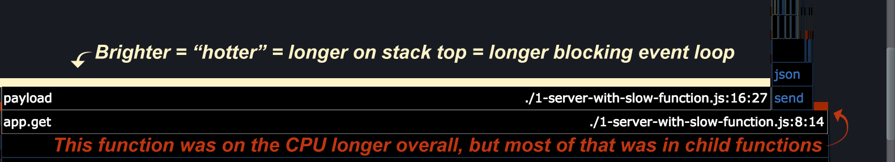

# Flamegraphs

Let's take a look again at the flamegraph generated in the prior [First analysis](/documentation/flame/03-first-analysis/) step.

Ignoring the surrounding controls for the moment, let's focus in on understanding the visualization.

When generating a flamegraph we are asking three key questions:

- During the sampling period, which functions called each other?
- How much time was each function observed on-CPU?
- How much time was each function observed at the top of the stack?

These three questions are answered visually.

## Which functions called each other (the stack)

Each block represents the invocations of one function, aggregated by the call stack that led to it. When one block sits on top of another, it was called by the block below it, which was called by the block below it, and so on down the stack.

In Clinic.js Flame, the text and outline colours of each block help you navigate. White represents code in the application being profiled (i.e. code under your direct control). Blue represents your dependencies in `node_modules`, while grey represents code in Node.js core itself.

## How long, in aggregate, was a function on-CPU (block width)

The width of a block represents the amount of time it was on the CPU, out of the duration of the profile run. This does not necessarily mean the function was executing its own code: where there are blocks above it, it had called that function and was waiting for it to complete.

Clinic.js Flame sorts the functions called by each function so that the widest blocks (the functions spending longest on the CPU) are shown first, on the left.

## How often was a function at the top of stack ("heat")

This can be rephrased as: "For how long was a function blocking the Node.js event loop".
If a function is frequently observed at the top of the stack, it means it
is spending more time executing its own code than calling other functions
or allowing function callbacks to trigger.

In Node.js, only one function can execute at any one time (ignoring possibilities like Worker threads). If a function takes a long time to execute,
nothing else can happen, including the triggering of I/O callbacks. This is the essence of the phrase "blocking the event loop".

The brightness of the bar along the exposed top of a block indicates the percentage of time a function was observed at the top of the stack. In other words, the hotter (or, brighter) a block, the more actual time it was taking to execute its own code, preventing any other code from executing.

When a function is blocking the event loop in higher proportion to other functions we call this a "hot" function. Looking for these "hot" functions is a good place to start looking for places to optimise your code. Clinic.js Flame by default selects the "hottest" frame, and gives controls to cycle through the next hottest.

---

##### Up next

[Controls](/documentation/flame/05-controls/)
