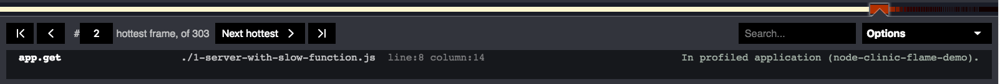

# Controls

The Clinic.js Flame UI controls have three main sections:

- **Flamegraph controls**: Interacting with the flamegraph itself
- **Info Panel**: Along the top, containing info about the block currently highlighted
- **Options Menu**: More advanced controls expandable from the info panel

## Flamegraph controls

#### Interacting with a flamegraph block

**Hovering** the mouse over a block will temporarily show info about that
block in the info panel at the top of the screen.

**Clicking** will select the block, so that the info panel reverts to that
block when you are no longer hovering over anything.

If you find an interesting-looking block, it can be useful to click on it
so you can hover around exploring its neighbours without losing it.

<video src="/assets/videos/flame-docs-A.mp4" playsinline loop autoplay muted></video>

#### Tooltip buttons

After single-clicking on a block, or hovering over it for a moment, a tooltip appears,
with one or more buttons:

- **Expand**. [See below](#expanding) for more about expanding a particular block.
- **Contract**. If this is the block that you have already expanded, it will show
  "Contract" instead of "Expand", which will take you back to the main view.
- **Copy path**. Copies to the clipboard the relative file path to the file
  containing the code this block represents. This only appears for blocks
  from the application being profiled (white) or its dependencies (blue).
- **Open in browser**. For Node.js core blocks only (grey). In a new browser tab,
  opens the GitHub page showing the source code for the Node.js function
  represented by this block. Exploring these can be a good way to learn
  more about what Node.js is doing "under the hood".

<video src="/assets/videos/flame-docs-B.mp4" playsinline loop autoplay muted></video>

#### Expanding

When a block is double-clicked, or its tooltip "Expand" button is used,
it will expand to fill the full width of the flamegraph.
Blocks below will also expand and fill
the full width, while blocks above the clicked block will
increase in ratio to the block they sit on. Expanding a block
essentially creates a new flamegraph which represents a particular
partition of the main flamegraph.

The block that has been expanded is marked with a shadow underneath.
Every block below this 'shadow' is probably wider (longer on the CPU)
than the block that has expanded to fill the screen.

To get back to the main, non-expanded view, you can either click on the
background, click "Return to main view" at the bottom of the screen,
double-click on the expanded frame, or click on its "Contract" tooltip button.

<video src="/assets/videos/flame-docs-C.mp4" playsinline loop autoplay muted></video>

## Info panel

There are five main features in the Info Panel:

- **Stack bar**: A thin bar showing the "hottest" blocks in order
- **Selection controls**: Flick to the next hottest, previous, etc
- **Code info**: Where the function behind the currently highlighted block comes from
- **Search box**: For finding functions by name or path
- **Options Menu**: More advanced features. This [Options Menu has its own section below](#options-menu)

#### Stack Bar

We previously explained, in the [Flamegraphs](/documentation/flame/04-flamegraphs/) page,
how it is useful to consider how much time a function was at the top of the stack,
meaning the Node.js event loop was blocked as the CPU executes code within that
function; and how this is represented by the brightness or "heat" of the colour
of the exposed part of a block.

This bar shows you the heat of those exposed stack tops, of every block in the
flamegraph, in order of heat i.e. in order of how long that block's function
was blocking the event loop.

You can run the cursor along this bar from left to right to see where these
"hot" functions are on the main flamegraph, with the same interaction as above:
hover to see info, click to select and show tooltip, double click to expand.

The left-most (hottest) block is selected by default when a Clinic.js Flame profile
is first opened.

<video src="/assets/videos/flame-docs-D.mp4" playsinline loop autoplay muted></video>

#### Selection Controls

These buttons allow you to easily jump from the currently selected block, to the
block that is one to the left or right of it in the hottness-ranking shown by
the Stack Bar.

A good place to start with a Clinic.js Flame flamegraph, is to cycle through
using the "Next hottest" button, and for each block it selects, think why that
function might be spending so much time active. For example, it might be a slow
function needing optimising, or it might be a function you know is fast, but
when you look at what is below it in the flamegraph, you might discover
that it is being called too many times (for example, it might be in a nested loop).

<video src="/assets/videos/flame-docs-E.mp4" playsinline loop autoplay muted></video>

#### Code info

This gives you more complete information about the code behind the block that is
currently highlighted.

- Function name (or equivalent) on the left. Anonymous functions are labelled
  `(anonymous)`.
- File path (or equivalent) in the middle, including line and column number (if
  applicable).
- Context. This tells you what category this block is (for example, dependency), and
  may include additional information if certain
  [advanced controls](/documentation/flame/09-advanced-controls/) are used.

#### Search box

If there is some particular file or function(s) you want to locate, you can type part
of the function name, file path or equivalent here, and any matches will be highlighted,
in the same colour used for text and outlines (white for code from the profiled
application, blue from a dependencies, grey from Node.js itself).

This can be useful if you've done such a good job optimizing an operation, you can
no longer find it on the flamegraph!

If a function you know exists can't be found _anywhere_, even using search, it's possible
it might have been inlined by V8: try searching again after turning off ["Merge" in
the Options Menu](#advanced). For more on merging and inlined blocks, see the section
["Merging and Unmerging" in Advanced Controls](/documentation/flame/09-advanced-controls/#merging-and-unmerging)

If it is possible the function was so fast, or on the CPU for so little time, that it was
never on the CPU while a sample was being taken, it might appear if you create a new profile
with a [longer duration and/or more connections in Autocannon](https://www.npmjs.com/package/autocannon#usage).

## Options Menu

Clicking "Options" on the right side of the Info Panel opens a menu with
more advanced options.

#### Visibility by code area

These toggle buttons show (tick) or hide (untick) blocks based on where the
code is in the application or Node.js framework.

- **[Application name]**: Code inside the main package being profiled. Visible by default.
- **Dependencies**: Code in a dependency in a `node_modules` directory. Visible by default.
- **Node JS**: Code inside Node.js core. Visible by default.
- **V8**: Functions inside the V8 JavaScript engine. Hidden by default, recommended for
  advanced users only. [More info](/documentation/flame/09-advanced-controls/#v8)

#### Advanced

- **Init**: Allows initialization functions to be shown that Flame hides by default.
  [More info](/documentation/flame/09-advanced-controls/#init)
- **Merge**: Allows different stacks to be shown for functions that V8 has optimised.
  [More info](/documentation/flame/09-advanced-controls#merging-and-unmerging/).

#### Preferences

- **Presentation mode**: Increases text sizes and colour contrasts, which can be useful
  if Clinic.js Flame is being presented under suboptimal conditions (e.g. on a projector in
  a brightly lit room).

Profiles can be set to show in Presentation Mode by default by
setting the `PRESENTATION_MODE` environment variable to `TRUE`.

<video src="/assets/videos/flame-docs-F.mp4" playsinline loop autoplay muted></video>

---

##### Up next

[Optimizing a hot function](/documentation/flame/06-optimizing-a-hot-function/)
