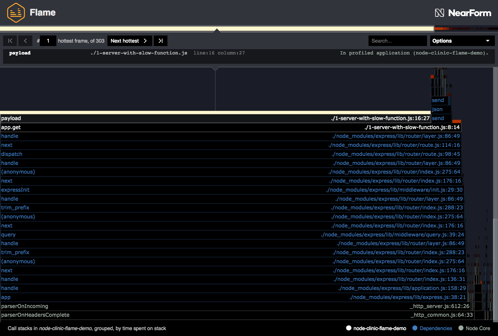
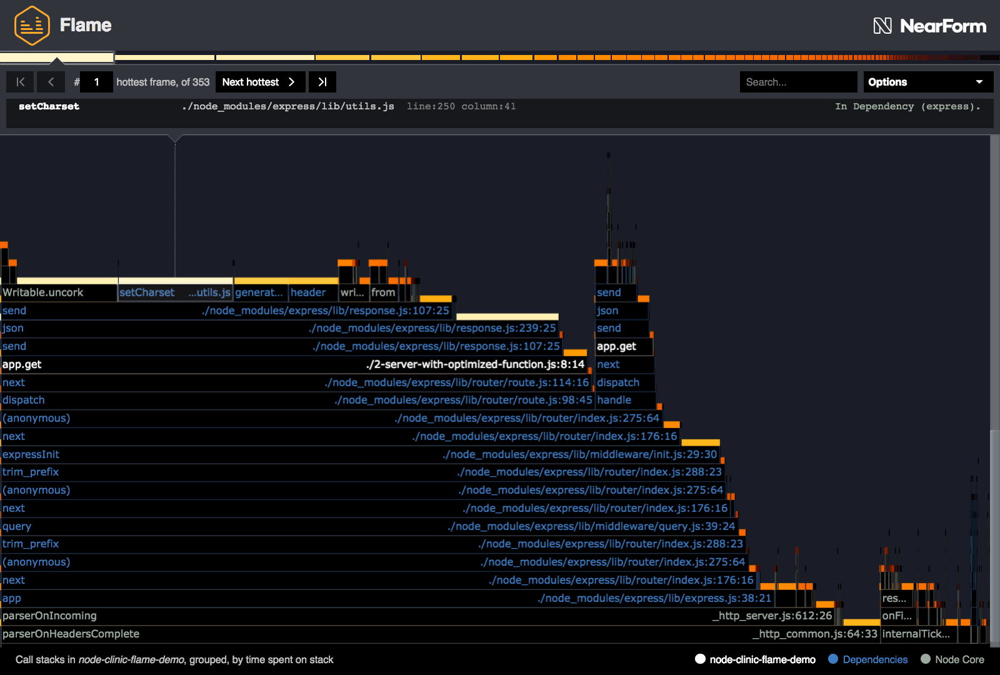
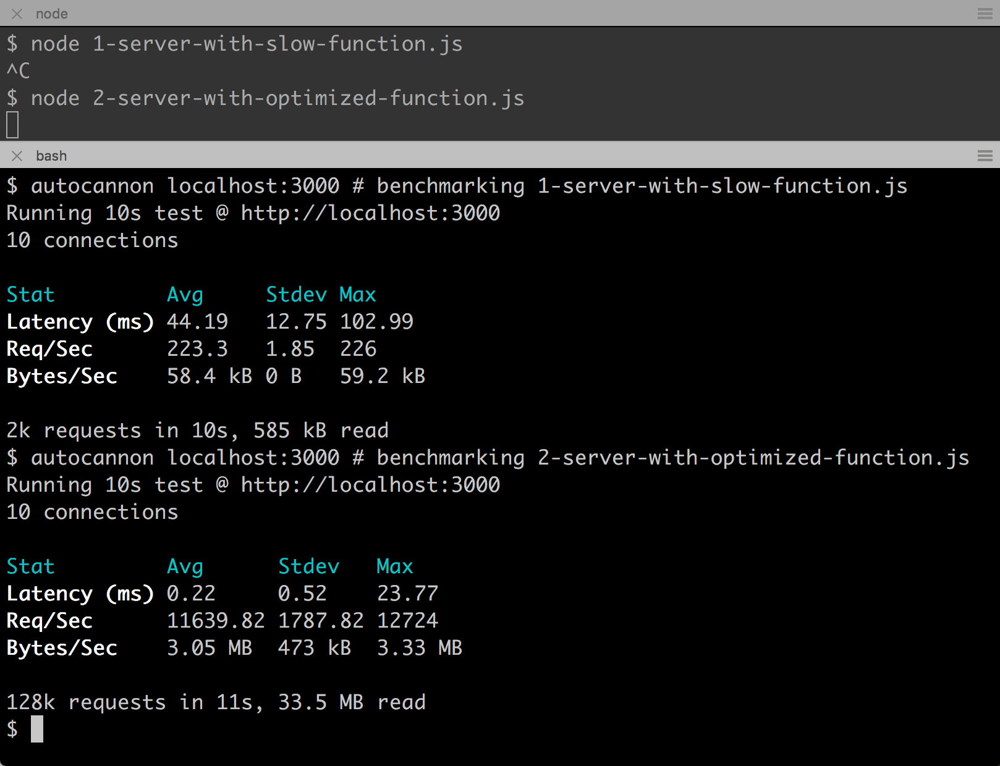

# Optimizing a hot function

The Clinic.js Flame UI has pointed us towards the "hottest" functions. One clearly
stands out: the `payload` function in `1-server-with-slow-function.js`, line 15.

We can also see that this hot `payload` function is called by `app.get` on line 8, column 14.



Let's take a look at the function starting at line 8:

```js
app.get('/', (req, res) => {
  res.send(payload())
})
```

The function is actually a fat arrow function, which is anonymous.
In the absence of a name, the Flame sampler names this function `app.get`
because it's _passed_ to `app.get`. The column number (14) makes it clear
that the function in question is the fat arrow function.

This is the route handler for `/` which is called every time a request is made.
It's calling the `payload` function (our bottleneck) and then passing it to `res.send`.

Let's take a look at line 16:

```js
return function payload() {}
```

Since there's a `return` statement there must be an outer function. Let's take a look
at the whole thing, including the outer function which creates the `payload` function:

```js
function initPayload(idSize = 20) {
  return function payload() {
    let chars = ''
    let n = idSize
    const date = Date.now()
    const radix = 36
    n *= n * idSize
    while (n--) {
      const num = date + n
      chars += num.toString(radix).toUpperCase()
    }
    const id = chars.slice(-idSize)
    return { date, id }
  }
}
```

So in the `initPayload` scope there is a parameter, `idSize` with a default value of `20`.

The `payload` function is returning an object with a `date` field and an `id`
field. The date is created with `Date.now()` so it doesn't look like we can optimize
much there. Let's focus on how the `id` is created.

The variable `n` is set to the `idSize`, but then later multiplied by itself times
the `idSize`, which is essentially n³. The `n` variable is then
decreased by one per each iteration of a `while` loop. The body of the `while` loop
is adding the `date` timestamp and `n` together and then calling `toString(36)`
(the `radix` constant is `36`) which will convert the number to an alphanumeric string (base36).
This base36 string is then upper cased and added to the `chars` string. Finally the
a slice with a length corresponding to `idSize` is taken from the `chars` string
to form the `id`.

What an odd and over-engineered way to create an ID. Surely no
one would really write code like that? _(Narrator: "They do.")_

Let's improve the algorithm, but keep the same fundamental qualities of the id:

- It must be an alphanumeric string
- It must be configurable by `idSize`
- It will never be less than 6 characters long

A more optimal version of the `initPayload` function looks like so:

```js
function initPayload(idSize = 20) {
  if (idSize < 6) throw Error('idSize must be greater than 5')
  const max = 2147483647
  var count = 0
  return function payload() {
    count = (count + 1) % max
    const date = Date.now()
    const chars = count.toString(36).toUpperCase()
    const id = '0'.repeat(idSize - chars.length) + chars
    return { date, id }
  }
}
```

The `max` number is the largest 32bit integer (2³¹ - 1) we use this
to cycle count back round to 0 when it reaches 2³¹. This isn't strictly
necessary for speed in our case, but Node's JavaScript engine (V8) is
optimized for the numbers in 32bit range (since most numbers in practice
tend to be). Additionally, when converted to base36 is (2³¹ - 1) 6 characters,
which means we don't have use a minimum length offset to enforce `idSize`.

Each time the `payload` function is called, `count` is increase by one.
We turn `count` into a base36 string, and upper case it. Then we pad
the beginning of the string with the necessary amount of zeros (which is valid base36)
to create an `id` with a length corresponding to `idSize`.

#### Testing the optimized function

The optimal `payload` function is in `2-server-with-optimized-function.js`. Let's
profile this server with Flame to assess the result:

```bash
clinic flame --on-port 'autocannon localhost:$PORT' -- node 2-server-with-optimized-function.js
```

This should generate something like the following:



This immediately looks healthier - it's no longer dominated by just one function,
and as a result we have a range of shades of yellow and orange.

Notice the `payload` function is nowhere to be seen. This is because the function
was inlined into its parent: the anonymous lamda function labelled as `app.get`.
There is more information on inlining and merging on the
[Advanced Controls page](/documentation/flame/09-advanced-controls/#merging-and-unmerging).

Using `autocannon` we can show that our optimization has lead to our server
being over 50 times faster (220 req/s vs 11640 req/s).



---

##### Up next

[Reducing the graph size](/documentation/flame/07-reducing-the-graph-size/)
