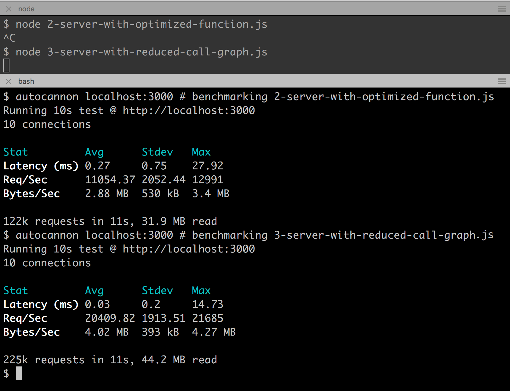

# Reducing the graph size

While Flamegraph's highlight bottlenecks primarily through visualizing
the top-of-stack metric, they can also be used to understand application
complexity.

If a flamegraph has a lot of high rising stacks, this can
also be thought of as a distributed bottleneck. If we can find ways
to reduce the graph size, perhaps by removing unnecessary layers,
this can also improve application performance.

One potentially low hanging fruit can be replacing libraries with
simpler or smarter alternatives that create and call less functions
in the hottest paths.

Let's take a look at the flamegraph we already generated for `2-server-with-optimized-function.js`:


In `3-server-with-reduced-call-graph.js` we change the web framework
from Express to [Fastify](https://www.fastify.io/).

Let's generate a flamegraph for `3-server-with-reduced-call-graph.js`:

```bash
clinic flame --on-port 'autocannon localhost:$PORT' -- node 3-server-with-reduced-call-graph.js
```

Let's take a look at the resulting flamegraph:


This is clearly simpler, and there's much less blue meaning less activity in dependencies.
There's a tall blue column on the right, but it's very thin: therefore there is complexity
there, but it is fast. There are, however, some hot frames under `handleRequest`, so
there may still be more we can do.

First, however, we must confirm that performance really has improved. Reducing
function calls and complexity doesn't always result in a faster application. We can
measure the difference between `2-server-with-optimized-function.js` and
`3-server-with-reduced-call-graph.js` using `autocannon`:



That's a huge improvement. By swapping to a framework that focuses on
reducing the function graph complexity, performance has significantly improved.
In fact, we can now serve close to double the amount of requests.

---

##### Up next

[Advanced analysis](/documentation/flame/08-advanced-analysis/)
