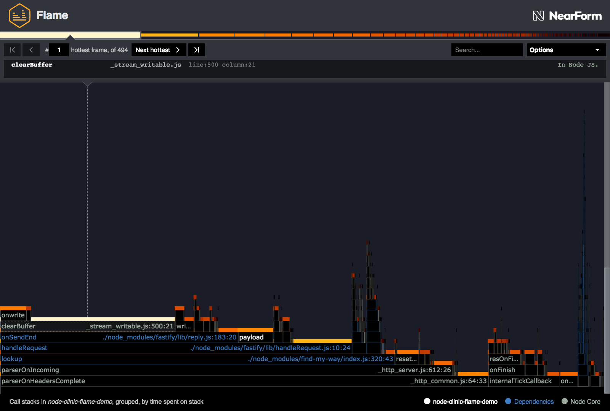
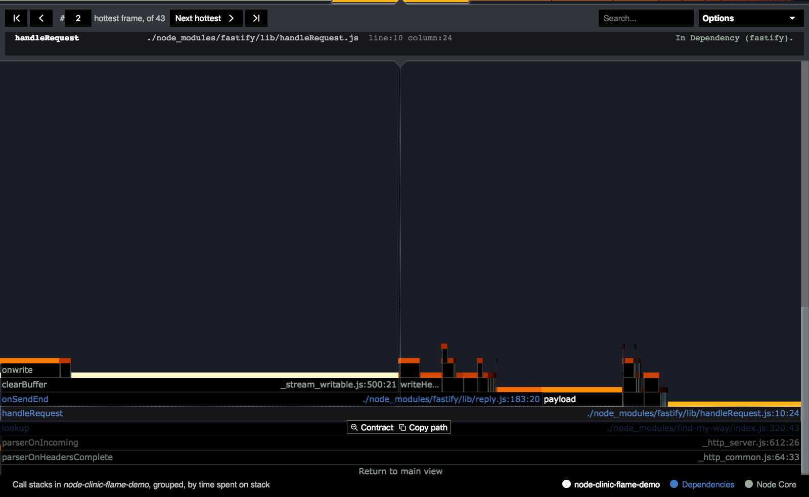
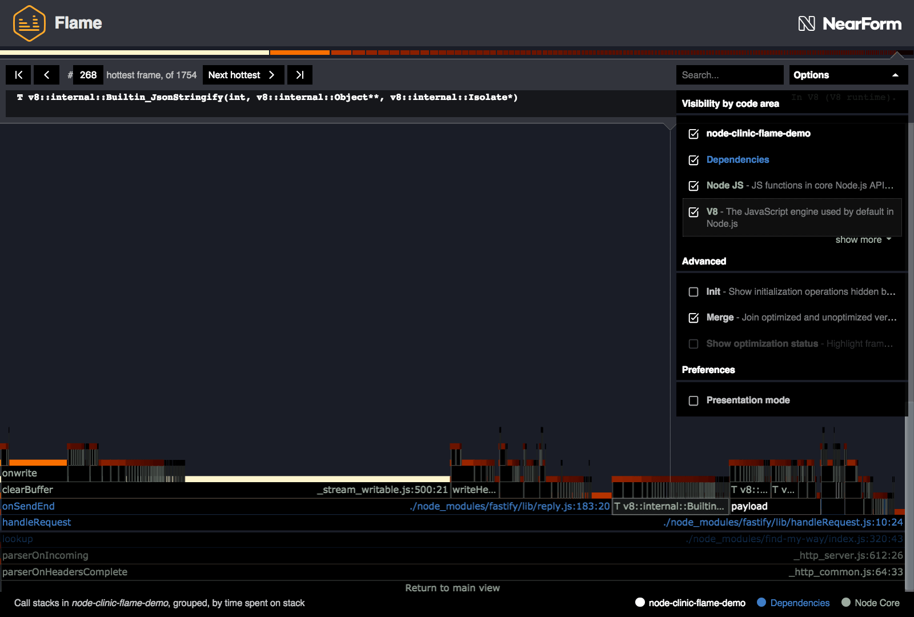
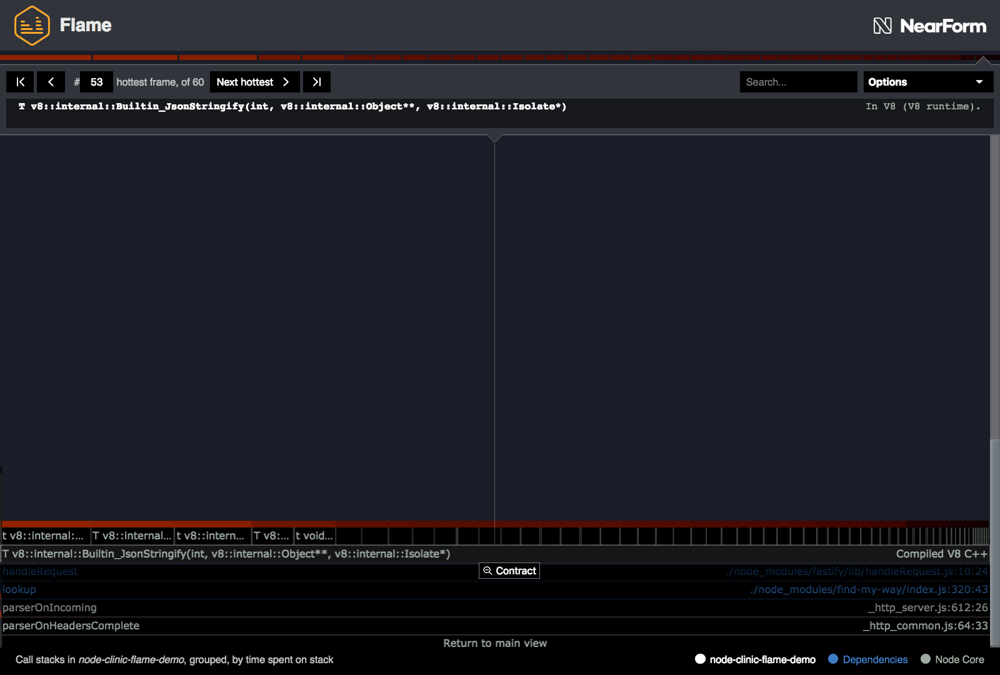
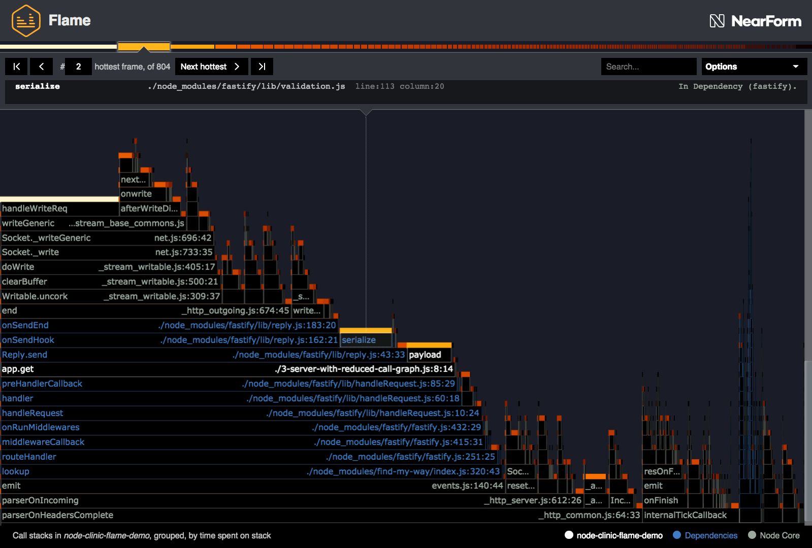
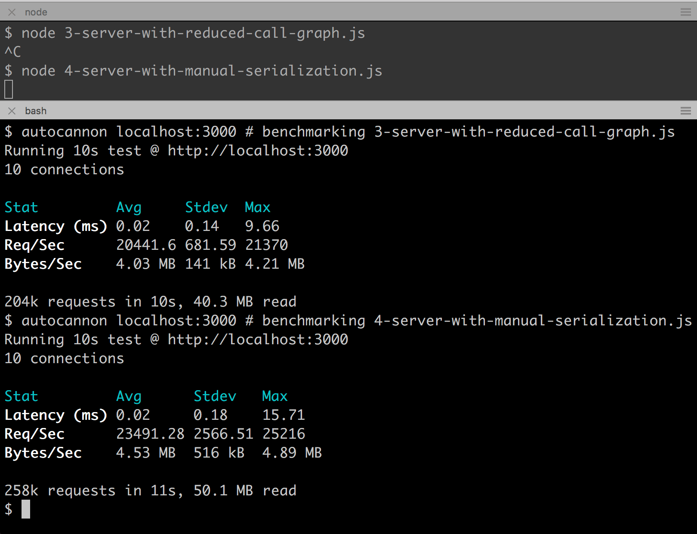

# Advanced analysis

We still have some hot blocks in our latest flamegraph:



None of the hottest blocks refer to any of our code,
but let's take a minute to think through what's happening.

The hottest is `clearBuffer` in `_stream_writable.js`.
This is part of Node core. Since the goal here isn't to begin
optimizing Node core, let's look at the next hottest block:
`handleRequest`.

We can expand the `handleRequest` block to look
something like the following:



Looking at the three hottest functions in this sub-view:

1. Node.js's `clearBuffer` is first and accounts for most of the time spent
   inside `onSendEnd`. As discussed, optimizing that will probably be difficult.
2. Second hottest is the Fastify function `handleRequest`, which has many children
   so is clearly quite complex.
3. Third is in our own `payload` function - but we've already optimized that.

So, why are we spending a long time inside `handleRequest`? If we click copy path
to look at the Fastify code, there's nothing obviously wrong, and we know
Fastify is quite well optimized for performance.

Maybe something is missing? Let's open the Options menu and tick the
unticked "V8" button, showing operations inside the V8 JavaScript
engine that are normally hidden:



The gap almost completely disappears, and a new block appears (selected in the
above screenshot), starting `T v8::internal::Builtin_JsonStringify`. This means
it refers to a C++ function inside V8, named `Builtin_JsonStringify`. Clearly,
this is related to `JSON.stringify()`.

It's worth knowing that the JavaScript wrappers `JSON.stringify()` and
`JSON.parse()` that we are familiar with are not sampled directly by V8, which
instead skips straight to the underlying C++ implementation.

Expand that, and we see V8 needs to do many, many steps when trying to
stringify some JSON.



This is a case where instead of focussing on one "hot" function, we need to focus
on an inefficient parent function that is calling many micro-tasks. Each one looks
pretty fast - the problem is, they add up to a lot of time.

Why is JSON stringification happening here? It's because we send an object, and both
Express and Fastify will automatically serialize an object passed to their `send` method.

This bottleneck becomes a lot clearer when we turn off inlining.

Let's run the following command:

```bash
 clinic flame --on-port 'autocannon localhost:$PORT' -- node --no-turbo-inlining 3-server-with-reduced-call-graph.js
```

This will produce a flamegraph similar to the following:



We have a new second-hottest function (after the Node core one) - `serialize`.
This was previously hidden due to being inlined by V8.

With none of the functions inlining, it becomes a lot more apparent that
the `serialize` function is a bottleneck. Whereas _with_ inlining the hot
blocks were seen more on the top of the stack _because_ they represent
several other functions that have also been inlined into them.

The `4-server-with-manual-serialization.js` alters the line 23 in the `payload`
function from `return {date, id}` to:

```js
return `{"date": ${date}, "id": "${id}"}`
```

It should be noted here that this technique may be inappropriate in many cases,
for instance where escaping inputs is crucial to security. An alternative to
manual serialization which is still faster than using `JSON.stringify` is
schema-based serialization using [fast-json-stringify](http://npm.im/fast-json-stringify). The Fastify web framework also supports schema-based serialization by default,
see [Fastify's Serialization
Documentation](https://github.com/fastify/fastify/blob/master/docs/Validation-and-Serialization.md#serialization).

Let's run Clinic.js Flame to create a flamegraph for `4-server-with-manual-serialization.js`:

```bash
clinic flame --on-port 'autocannon localhost:$PORT' -- node 4-server-with-manual-serialization.js
```

This should give something like:


We can see the the hottest block is a Node core function, `Socket._writeGeneric`,
which is called by `clearBuffer`. It's same Node core bottleneck as before, it's just that
in this sampling period the V8 engine _didn't_ inline `Socket._writeGeneric` into
`clearBuffer`.

Let's use `autocannon` to determine the effect this has had on server performance:



We've achieved roughly another 10% improvement.

At this point further optimization of the application becomes increasingly challenging,
since functions in Node core have become the primary bottleneck. A few more percent could
be squeezed out here and there, especially if we were willing to change the constraints
of the `id` field.

However, for the most part, our work here is done.

---

##### Up next

**The walkthrough is complete.** Congratulations! You should now be able to use
Clinic.js Flame to solve common performance problems.

You may also choose to continue to read about Flame's
more [advanced controls](/documentation/flame/09-advanced-controls/).
