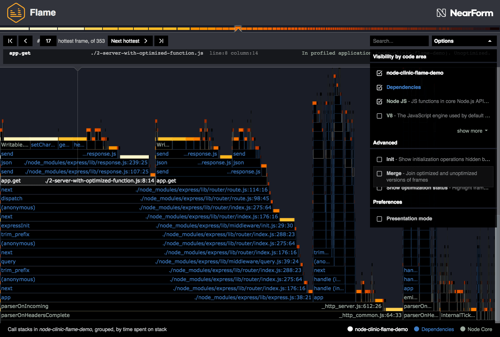
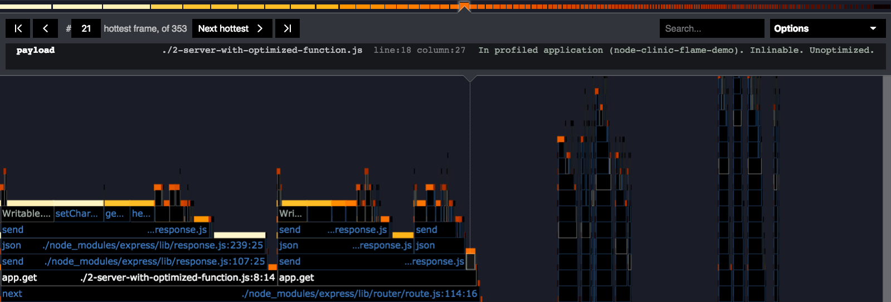
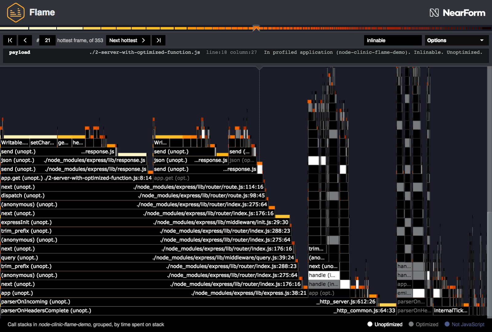

# Advanced controls

This section provides further reference information on some of Clinic.js Flame's advanced features.

## Init

Clinic.js Flame by default hides various initializaton functions. Filtering out these frames
reduces generally redundant initialization noise.

They include:

- Internal module system functions which are repeated frequently as the dependency tree
  is loaded (such as `require()`)
- Functions relating to Clinic.js Flame's own data capture
- Other initialization functions

An option in the ["Advanced" section of the Options Menu](/documentation/flame/05-controls/#advanced)
allows these to be shown.

When shown, Init blocks are presented like all other blocks, and will be shown or hidden
according to the options selected in "Visibility by code area". The only differences is
that when shown in the [Info Panel](/documentation/flame/05-controls/#info-panel), the
context section on the right states _"In initialization process"_.

## Merging and unmerging

V8 may apply automatic optimizations to some frequently-run code, creating
optimized versions of those functions. At an internal JavaScript engine level,
optimized and unoptimized functions are separate entities.

#### Optimized and unoptimized code

By default, Clinic.js Flame merges all Optimized and Unoptimized functions, and
represents them as single blocks. It also merges all inlinable functions in to
the calling functions that they are later inlined into. This creates a simplified
graph where stacks only diverge based code logic.

Unticking "Merge" in the ["Advanced" section of the Options Menu](/documentation/flame/05-controls#advanced)
separates Optimized and Unoptimized functions, showing them as seperate blocks and seperate stacks.

This is the unmerged view of the flamegraph we created for
[Optimizing A Hot Function](/documentation/flame/06-optimizing-a-hot-function/#testing-the-optimized-function).
Note how `app.get` (among others) forks into two stacks. One is the
original unoptimized function, the other is the optimized version.

The [Info Panel](/documentation/flame/controls/#info-panel) shows the highlighted block's
optimization status, in the context section on the right. For all JavaScript blocks,
this will say either _"Unoptimized"_ or _"Optimized"_. If the block is inlined by V8,
it will also say _"Inlinable"_.

#### Show optimization status

With "Merge" unticked, there is another way to see which blocks are Optimized or
Unoptimized. Another option, "Show optimization status", becomes available when "Merge" is
unticked. If this is ticked, the text and outline colours of blocks are changed,
along with the key at the bottom right of the flamegraph, to show:

- Unoptimized blocks in white
- Optimized blocks in grey
- Blocks where optimization is not relevant because they don't represent JavaScript in blue

Inlinable functions can be found by typing "inlinable" into the search box
while "Merge" is unticked.

For example, in the above flamegraph (the one we generated while
[Optimizing A Hot Function](/documentation/flame/06-optimizing-a-hot-function/#testing-the-optimized-function)),
we can see more easily that `app.get` forks into an optimized and unoptimized branch, and in
the optimized branch, `payload` (selected) is flagged as "Inlinable".

This is why, when we looked at that flamegraph in the default merged view, it
was absent. It was inlined into its parent function, the optimized version
of `app.get`.

## V8

In addition to showing functions from the Node.js framework, Clinic.js Flame can be set
to show functions from within the V8 JavaScript engine, by ticking the "V8" checkbox
in the ["Visibility by code area" section of the Options Menu](/documentation/flame/05-controls/#visibility-by-code-area).

This often adds a significant amount of complexity to the flamegraph, much of which
may not be wanted. Flame therefore allows users to expand the V8 options and filter
specific types of V8 function:

#### V8 Native

These are native JavaScript functions that are compiled into V8.

This would include any native prototype methods (`Array.prototype.join` for instance),
and any functions that aren't publicly exposed but are used internally by V8
(`InnerArrayJoin` for instance).

In addition, evaluated functions (either code run with `eval` or created with `Function`)
will also appear as native frames, with the file path shown as `[eval]`.

#### V8 Runtime

These are C++ frames pertaining to the runtime operations of V8's implementation
of JavaScript. Examples include (depending on V8 version) `StringEqual`
and `ObjectSetPrototypeOf`.

Tags can include `[CODE:LoadGlobalIC]`, `[CODE:Handler]`, `[CODE:CallIC]`,
`[CODE:LoadIC]`, `[CODE:StoreIC]`, `[CODE:Builtin]` ,
`[CODE:BytecodeHandler]`, `[CODE:Builtin]` , `[CODE:Stub]`.

#### V8 C++

These are C++ frames that are called by the V8 layer, not including C++ frames
that may be called in Node, Libuv or third party modules.

These frames can include the tags `[CPP]` and `[SHARED_LIB]`.

#### RegExp

RegExp stands for Regular Expressions. These are also captured as "frames".
In this case the regular expression notation fills in as the "function name" portion
of the block label. This can be useful in identifying slow regular expressions
(in particular [exponential time regular expressions](https://perlgeek.de/blog-en.cgi/perl-tips/in-search-of-an-exponetial-regexp.html)).

These will have the tag `[CODE:RegExp]`.
