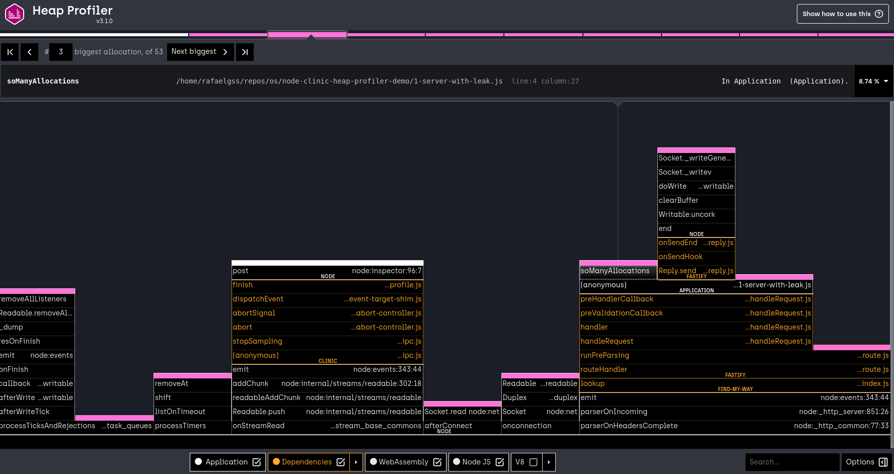
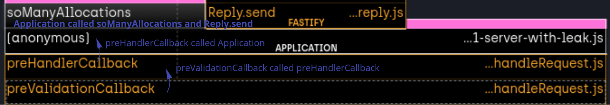
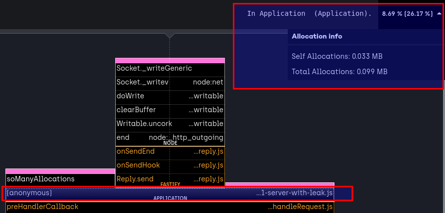
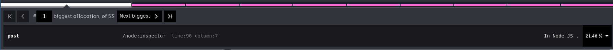
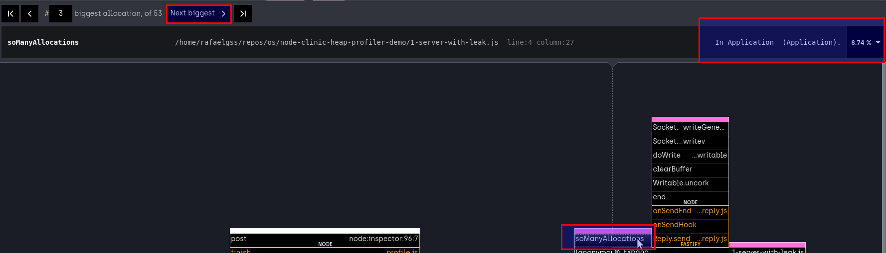

# Flamegraphs

Let's take a look again at the flamegraph generated in the prior [First analysis](/documentation/heapprofiler/03-first-analysis/) step.

Ignoring the surrounding controls for the moment, let's focus in on understanding the visualization.

When generating a flamegraph we are asking three key questions:

- During the sampling period, which functions called each other?
- How much memory was allocated by each function observed?
- What are the functions that allocate more memory on the heap?

These three questions are answered visually.

## Which functions called each other (the stack)

Each block represents the invocations of one function, aggregated by the call stack that led to it. When one block sits on top of another, it was called by the block below it, which was called by the block below it, and so on down the stack.

## How much memory was allocated by each function observed?

The width of a block represents the amount of memory that the function allocated. In the box at top-right contain the allocation info of the selected function.

## What are the functions that allocate more memory on the heap?

The "hottest" function in the profile is selected by default.

Here, we can see the function name and file location (or equivalent), so we can inspect the underlying code and decide if this function is something we can and should optimize.

The example above shows an Node.js function as the most hottest, you can click in "Next biggest" until reach an application function.

In the next chapter, we will see how to manage the UI to visualize only the meaningful data to the provided demo.

---

##### Up next

[Controls](/documentation/heapprofiler/05-controls/)
